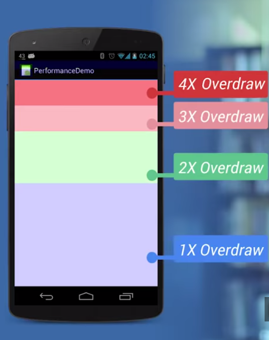
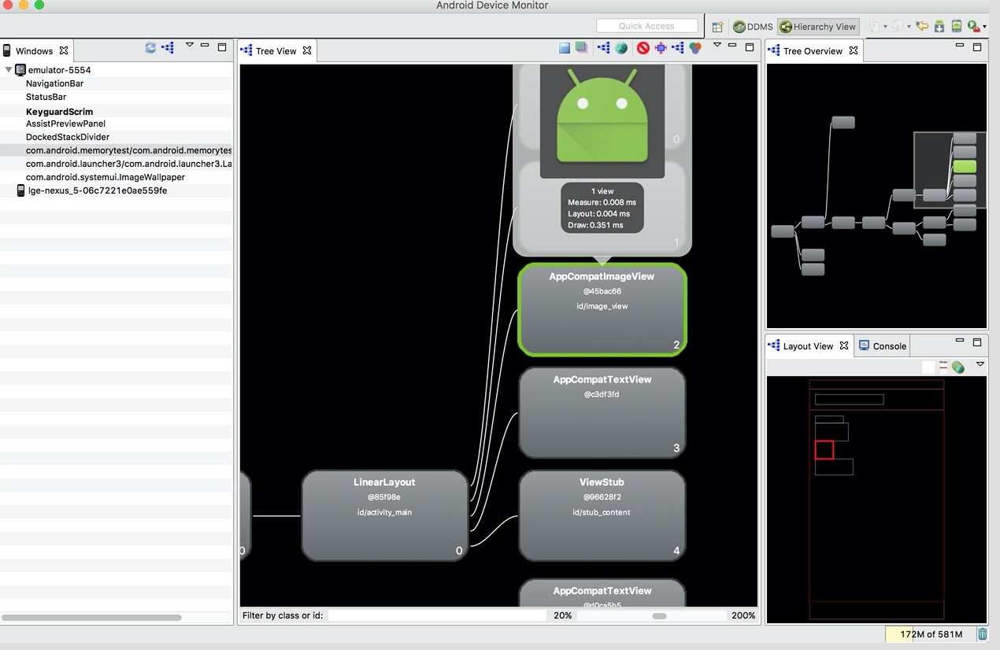

# Android绘制相关

#### Android绘制相关

Android系统显示原理
Android的显示过程简单概括为：Android 应用程序把经过测量、布局、绘制后的`surface`缓存数据，通过SurfaceFlinger把数据渲染到屏幕上

<!-- more -->

#### UI优化

1. Overdraw的检测

   设置 -> 开发者选项 -> 调试GPU过度绘制 -> 显示GPU过度绘制
   对比一张Overdraw的参考图：
   
   移除Activity的默认背景。

   Activity中Fragment背景

   ListView背景

   ListView的Header背景和item背景

2. 减少不必要的嵌套

   使用Hierarchy Viewer查看布局层级
   

`<include>`标签可以允许在一个布局当中引入另外一个布局。

`<merge>`标签是作为标签的一种辅助扩展来使用的，它的主要作用是为了防止在引用布局文件时产生多余的布局嵌套。

`<ViewStub>`虽说也是View的一种，但是它没有大小，没有绘制功能，也不参与布局，资源消耗非常低，将它放置在布局当中基本可以认为是完全不会影响性能的