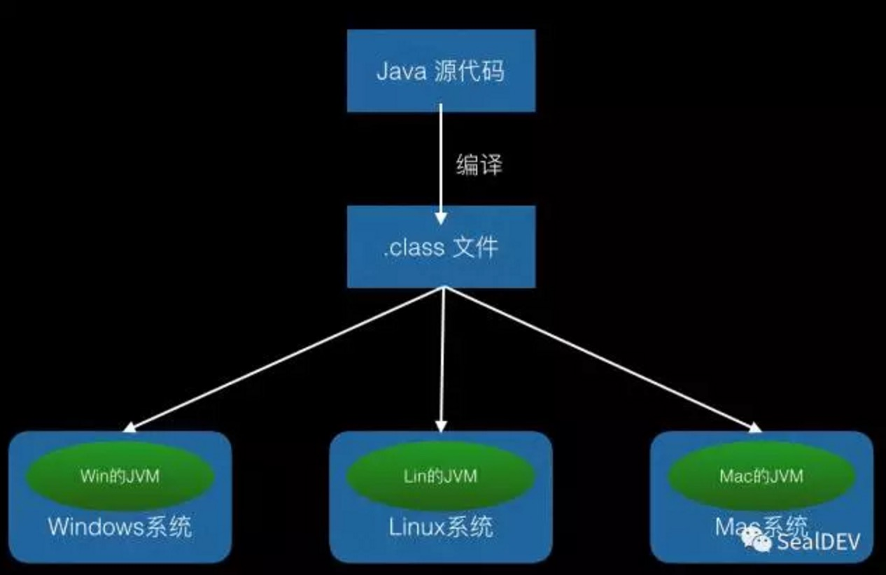
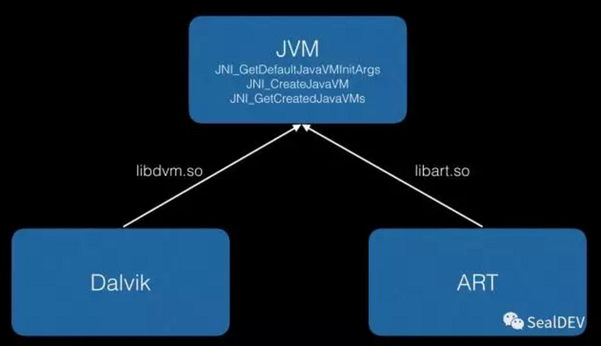
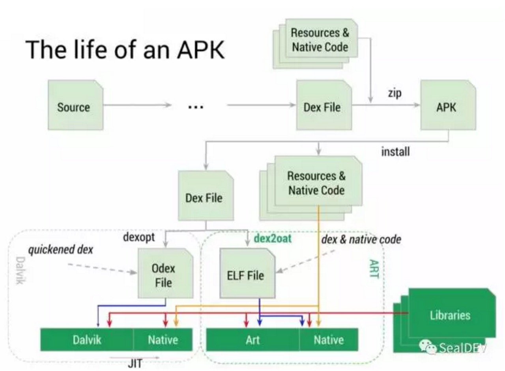

# Android APK 安装过程详解

#### APK 安装过程

开发 Android 应用后，一般都会安装到手机上去运行，了解应用是如何安装到手机上的，可以更好的理解应用的本质，理解应用是如何运行的，在自己开发的应用遇到一些问题时，会从更深层次去分析，快速定位找到原因。这一篇文章中我们就来详细分析一下应用是如何安装的。

<!-- more -->

#### 背景知识

要想详细了解 APK 的安装过程，需要了解一些基础概念，包括：

1. 什么是 APK
2. 什么是 DEX 文件和 ODEX 文件
3. 什么是 OAT 文件
4. 什么是 Dalvik 和 ART

总体来说是：APK 是 Android 应用安装包，Dalvik 和 ART 都是 Android 运行环境，但是由于 Dalvik 存在一些不足，ART 是在高版本手机上替换 Dalvik 的。应用的安装过程就是将 APK 中内容解压处理的过程，Dalvik 会将 APK 中内容 DEX 转化为 ODEX，ART 会将其转化为 OAT。下面对这些问题分别进行分析。

#### 什么是 APK

APK，即 Android Package，Android 安装包。不同平台的安装文件格式都不同，类似于 Windows 的安装包是二进制的 exe 格式，Mac 的安装包是 dmg 格式。APK 的可以在 Android 上执行安装，APK 的本质是一个 Zip 压缩包，只是后缀被修改为 apk，其中打包了源代码编译出的 class.dex、一些图片视频资源文件和一些 Native 库文件。APK 文件与 Zip 文件最大的一个不同是 APK 包含签名信息，用于保证安装包安全不被修改。

#### 什么是 DEX 文件和 ODEX 文件

说起 DEX 文件，不得不提 class 文件。Java 跨平台是由源代码编译出的 class 文件分别运行在不同平台的虚拟机上，由虚拟机屏蔽了不同平台的差异。如图：

但是由于 Android 系统针对手持设备，对 Dalvik 虚拟机进行了优化，主要包括：

1. 将原来 class 文件进行优化，例如将其中的常量冗余信息进行合并，提高虚拟机解析效率；
2. 修改 JVM 运行时基于栈的数据结构修改为 Dalvik 基于寄存器的数据结构，数据访问方式更快，运行效率更高。

这种情况下，原来的 .class 文件就有些不适用了，因此，出现了 dex 文件格式，它是源代码编译后打包生成的文件。它是 APK 的一个组成部分。

ODEX 文件是 Dalvik 将 DEX 文件中可执行文件——class.dex——文件解压出来后，存储在本地后生成的。因为 Android 系统无法直接运行 APK 文件，需要将其解压后找到 class.dex 文件后才可以运行，因此在安装时就将其取出放在本地，可以提高应用启动速度。除了这个原因，其实在将 class.dex 转换成 ODEX 文件过程中，还根据当前系统进行了优化（直接复制到其他系统不一定可以运行），文件大小会减少，ODEX 文件比 DEX 文件更难反编译，这也在一定程度上提高了安全性，因此在一些系统预装或系统级应用大多采用了 ODEX 优化。

一般 ODEX 不直接运行，在 Dalvik 运行 ODEX 时，需要通过 JIT 进行优化，提高运行效率。JIT 是一种在运行时同步将字节码转化成机器码的过程，Dalvik 直接运行转化后的机器码，这会导致部分的内存和时间开销，但是整体来说，在某些情况下是会提高系统性能的。（有些动态编译器，可能根据经验或尝试编译，优化这一过程，可能运行次数越多，优化效果越好）

#### 什么是 OAT 文件

OAT 文件是 ART 运行的文件，是一种二进制可运行文件，包含 DEX 文件和编译出的本地机器指令文件，其文件格式类似于网络数据报文，包含文件头和文件体，文件头的 oatdata、oatexec 和 oatlastword 字段分别描述 DEX 文件位置和本地机器指令的起止位置。因为 OAT 文件包含 DEX 文件，因此比 ODEX 文件占用空间更大，由于其在安装时经过了 ART 的处理，ART 加载 OAT 文件后不需要经过处理就可以直接运行，它没有了从字节码装换成机器码的过程，因此运行速度更快。可以理解为 JIT 从运行时才解析提前到了安装时解析，安装变慢，运行变快。
通过这种方式编译后，我们来看下生成的代码是怎样的。AspectJ的原理实际上是在编译的时候，根据一定的规则解析，然后插入一些代码，通过aspectj生成的代码，会在Build目录下：

#### 什么是 Dalvik 和 ART

上面提到了 Dalvik 和 ART，Dalvik 和 ART 是 Android 平台实现的 JAVA 虚拟机。用于解析 DEX 文件、ODEX 文件和OAT 文件。

ART 即 Android Runtime，Android 运行时，由于 Android 系统会运行在不同的设备上，底层硬件不同，Linux 系统屏蔽了一些这些系统的细节，但是直接在 Linux 上开发应用太难，实现成本太高，为了屏蔽 Linux 的细节，Google 创建出了 Dalvik 和 ART，对 Linux 进行了再一次封装，这样，使用 Google 提供的集成开发环境 SDK，就可以轻松开发应用了，Dalvik 与 ART 的关系是 ART 用来替换 Dalvik 的。Dalvik 在低版本（4.4 以下）的手机上使用作为 Android 运行环境，但是由于其有一些不足，在高版本的 Android 系统上 ART 用来替换 Dalvik，现在市场上 ART 的占有率已经超过了 70%。

ART 是 Android 应用的运行模式，在这种模式下，Android 应用在安装后，会进行一次预编译，将应用安装包中的字节码转换成机器语言存储在本地（系统只能运行二进制程序），这样，应用在运行时，可以直接执行这些二进制程序。相比较于 Dalvik 来说，Dalvik 的做法是在应用安装后，直接将字节码存储起来，在每次运行时，需要将代码编译成机器语言，这样在运行程序时，就比 ART 慢了一些。ART 这样做导致了安装后应用所占的空间更大，安装时间更长，但是对于经常使用的应用，这样做是值得的。

#### APK 是如何安装的呢？

了解了以上的知识，理解应用安装就简单了，我们整体看一下应用是如何安装的。

程序的源代码，首先经过 SDK 编译成 DEX 文件，DEX 文件和一些资源文件（图片、视频等）、Native Code（C 语言等编译出的 .so 文件）会直接打包进 APK。安装 APK 的过程，其实是安装包解压过程。资源文件、二进制库等解压后直接存储在本地，DEX 文件不仅仅解压，会根据系统的运行环境，采用不同的处理方式，被处理成不同格式的文件存储在本地，等待程序启动调用，这样就完成了应用的安装过程。

总结

这一篇文章中，我们详细介绍了 Android APK 的安装过程，分析了 Dalvik 和 ART 的不同以及安装过程的不同。

#### 参考资料：

[Android APK 安装过程](https://mp.weixin.qq.com/s/37wjSQs1HWVfX0xL27NjBg)