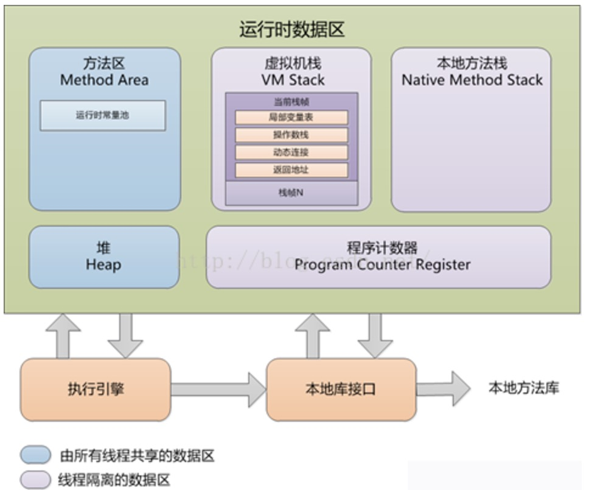

# Android内存优化相关

#### Java内存分配策略概述



<!-- more -->

- 虚拟机栈（Stack）
  存放基本数据类型和局部变量引用，但是对象本身不存放在栈中，而是存放在堆中。
  当一个方法即将被运行时，Java虚拟机栈首先会在Java虚拟机栈中为该方法创建一块“栈帧”，栈帧中包含局部变量表、操作数栈、动态链接、方法出口信息等。当方法在运行过程中需要创建局部变量时，就将局部变量的值存入栈帧的局部变量表中。当方法执行完毕后，这个方法所对应的栈帧将会出栈，并释放内存空间。
  Java虚拟机栈会出现两种异常：StackOverFlowError和OutOfMemoryError。
  Java虚拟机栈也是线程私有的，每个线程都有各自的Java虚拟机栈，而且随着线程的创建而创建，随着线程的死亡而死亡。
- 堆（Heap）
  在堆上分配内存的过程称作内存动态分配过程。在Java中堆用于存放由new创建的对象和数组。堆中分配的内存，由java虚拟机自动垃圾回收器（GC）来管理(可见我们要进行的内存优化主要就是对堆内存进行优化)。堆是不连续的内存区域（因为系统是用链表来存储空闲内存地址，自然不是连续的），堆大小受限于计算机系统中有效的虚拟内存。
- 方法区（Method Area）
  方法区也是线程共享的区域，用于存储已经被虚拟机加载的类信息，常量，静态变量和即时编译器（JIT）编译后的代码等数据。
- 运行时常量池（Runtime Constant Pool）
  是方法区的一部分。Class文件中除了有类的版本、字段、方法、接口等描述信息外，还有一项信息是常量池（Constant Pool Table），用于存放编译期生成的各种字面量和符号引用，这部分内容将在类加载后进入方法区的运行时常量池中存放。运行期间也可能将新的常量放入池中。

#### JVM垃圾回收

1. 垃圾对象的判定

   Java堆中存放着几乎所有的对象实例，垃圾收集器对堆中的对象进行回收前，要先确定这些对象是否还有用，判定对象是否为垃圾对象有如下算法：

   - 引用计数算法

     给对象添加一个引用计数器，每当有一个地方引用它时，计数器值就加1，当引用失效时，计数器值就减1，任何时刻计数器都为0的对象就是不可能再被使用的。
     引用计数算法的实现简单，判定效率也很高，在大部分情况下它都是一个不错的选择，当Java语言并没有选择这种算法来进行垃圾回收，主要原因是它很难解决对象之间的相互循环引用问题。

```
   public class Main {
       public static void main(String[] args) {
           MyObject object1 = new MyObject();
           MyObject object2 = new MyObject();
           object1.object = object2;
           object2.object = object1;
           object1 = null;
           object2 = null;
       }
   }
   class MyObject{
       public Object object = null;
   }
```

   - 根搜索算法

     Java和C#中都是采用根搜索算法来判定对象是否存活的。这种算法的基本思路是通过一系列名为“GC Roots”的对象作为起始点，从这些节点开始向下搜索，搜索所走过的路径称为引用链，当一个对象到GC Roots没有任何引用链相连时，就证明此对象是不可用的。在Java语言里，可作为GC Roots的对象包括下面几种：
     1、栈（栈帧中的本地变量表）中引用的对象。
     2、方法区中的静态成员。
     3、方法区中的常量引用的对象
     4、本地方法栈中JNI（一般说的Native方法）引用的对象。

2. 垃圾对象回收

   - 标记-清除

     该算法有如下缺点：
     （1）标记和清除过程的效率都不高。
     （2）标记清除后会产生大量不连续的内存碎片，当程序在以后的运行过程中需要分配较大对象时无法找到足够的连续内存而不得不触发另一次垃圾收集动作。
      

   - 复制算法
     

   - 标记-整理
   

   - 分代回收算法

#### Android的内存区域

1. Dalvik Heap，这部分的内存区域是由Dalvik虚拟机管理，通过Java中 new 关键字来申请一块新内存。这块区域的内存是由GC直接管理，能够自动回收内存。这块内存的大小会受到系统限制，当内存超过APP最大可用内存时会OOM
2. Native Heap，这部分内存区域是在C++中申请的，它不受限于APP的最大可用内存限制，而只是受限于设备的物理可用内存限制。它的缺点在于没有自动回收机制，只能通过C++语法来释放申请的内存
3. Ashmem（Android匿名共享内存），这部分内存类似于Native内存区，但是它是受Android系统底层管理的。

Android Dalvik Heap与原生Java一样，将堆的内存空间分为三个区域，Young Generation，Old Generation， Permanent Generation。
最近分配的对象会存放在Young Generation区域，对象在某个时机触发GC回收垃圾，而没有回收的就根据不同规则，有可能被移动到Old Generation，最后积累一定时间再移动到Permanent Generation区域。系统会根据不同的内存数据类型分别采用不同的回收机制。每一个Generation的内存区域都有固定的大小。执行GC占用的时间和它发生在哪一个Generation的内存区域有关，Young Generation中的每次GC操作时间是最短的，Old Generation其次，Permanent Generation最长。同时GC的执行时间也和当前Generation中的对象数量有关，数量越多，执行时间越长。
GC时会导致线程暂停，导致卡顿，在ART中对GC过程做了优化，据说内存分配的效率提高了10倍，GC的效率提高了2-3倍，不过主要还是优化中断和阻塞的时间，频繁的GC还是会导致卡顿。

#### Android App为什么会OOM呢？

其实就是申请的内存超过了Dalvik Heap的最大值。于是也诞生了一些比较”黑科技”的内存优化方案，比如将耗内存的操作放到Native层，或者使用分进程的方式突破每个进程的Dalvik Heap内存限制。

#### 自身内存占用监控

对于onLowMemory()与onTrimMemory(int)等是针对整个系统而言的。
通过Runtime.totalMemory-freeMemory即为当前应用使用的内存。
Runtime.getRuntime().maxMemory();
Runtime.getRuntime().totalMemory(); Runtime.getRuntime().freeMemory();

#### 避免内存泄漏

内存泄漏是指应用不再使用的内存对象，但垃圾回收时没有辨认出来，不能及时回收，一直保留在内存中长期占用一定的空间不能释放。

#### 内存泄露的危害：

- 过多的内存泄露最终会导致内存溢出（OOM）
- 内存泄露导致可用内存不足，会触发频繁GC，不管是Android2.2以前的单线程GC还是现在的CMS和G1，都有一部分的操作会导致用户线程停止（就是所谓的Stop the world），从而导致UI卡顿。

#### 常见内存泄漏场景

1. 及时关闭资源性对象
   Cursor File往往都使用了一些缓冲，在不使用时，应该及时关闭，以便它们的缓存数据能够及时回收。

```
   Cursor cursor = null;
   try{
       cursor = mContext.getContentResolver().query(uri,null,null,null,null);
       if (cursor != null) {
           // 处理数据
       }
   } catch (Exception e){
       e.printStatckTrace();
   } finally {
       if (cursor != null){
           cursor.close();
       }
   }
```

2. 注册对象未注销
   广播接收器、注册观察者等

3. 单例Context、static变量等

```
   private static Resources mResources;
   @Override
   protected void onCreate(Bundle state) {
       super.onCreate(state);
       if (mResources == null) {
           mResources = this.getResources();
       }
   }
```

4. Handler，AsyncTAsk，TimeTask等内部类
   当Activity退出时，消息队列中还有未处理的消息或者正在处理的消息，并且消息队列中Message持有Handler的实例，handler持有Activity的引用，导致Activity无法被回收。

   需要修改两个地方

   1）使用静态Handler内部类，如果你需要在Handler子类中调用外部类的方法，可以让Handler持有一个外部类的WeakReference对Handler持有的对象使用弱引用，这样在回收时，也可以回收Handler持有的对象。

   2）在Activity的onDestory时，应该移除消息队列中的消息，避免Looper线程的消息队列中有待处理的消息。asyncTask.cancel()。

```
   public class WeakRefHandler extends Handler
   {
       WeakReference<Context> mWeakContext; 
       public WeakRefHandler(Context context)
       {
           mWeakContext = newWeakReference<Context>(context);
       }
       @Override
       public void handleMessage(Message msg)
       {
           if((mWeakContext.get() instanceofActivity )&& ((Activity)mWeakContext.get()).isFinishing())
                   return ;
           if(mWeakContext==null){
               return ;
           }
           super.handleMessage(msg);
       }
   }
```

5. 集合中的对象没有清理造成的内存泄漏，特别是静态集合

6. SensorManager等系统服务

   系统服务可以通过Context.getSystemService 获取。通过Context.getSystemService()可以获取系统服务。这些服务工作在各自的进程中，帮助应用处理后台任务，处理硬件交互。部分服务使用时需要注册监听器，会导致服务持有了Context的引用，如果在Activity销毁的时候没有注销这些监听器，会导致内存泄漏。

```
   void registerListener() {
              SensorManager sensorManager = (SensorManager) getSystemService(SENSOR_SERVICE);
              Sensor sensor = sensorManager.getDefaultSensor(Sensor.TYPE_ALL);
              sensorManager.registerListener(this, sensor, SensorManager.SENSOR_DELAY_FASTEST);
       }
```

7. Bitmap及时调用recycle()

   在不使用Bitmap对象时，需要调用recycle()释放内存，然后将它设置为null。

#### 内存泄漏监控

LeakCanary是一个检测内存的开源类库，实际上就是在本机上自动做了Heap Dump，然后分析生成的hprof文件，展示结果。

- 实现监控
  导入SDK，builder.gradle文件中加入相关引用
  LeakCanary对应用的性能有一定的影响，特别是Heap Dump操作会消耗更多的系统资源，并且会引起卡顿现象。
  配置还releaseCompile和testCompile的依赖，就不需要担心对正式版本性能产生影响。

`LeakCanary.install()`会安装一个Leaks的APK，返回一个预定义的RefWatcher，同时也启用一个`ActivityRefWatvher`，用于自动监控`Activity.onDestory()`之后泄漏的对象。其原理是设置`Application的ActivityLifecycleCallbacks`方法监控所有Activity的生命周期回调。

默认情况下，只对Activity进行了检测。如果想要监控Fragment实例或者其他自定义的组件，可以在`Fragment.onDestory`方法，或者自定义组件的周期结束回调中加入如下实现：`Application.getRefWatcher().watch(this);`

也可以监控BroadcastReceiver，Service等其他有生命周期的对象等

- 自定义处理结果
  仅仅依靠默认的监控处理方式，在实际的开发和测试过程中体验不是很好，必须以来安装的Leaks应用，并且不好定制化，因此实现自定义的监控结果处理就很有必要。
  首先继承DisplayLeakService实现一个自定义的监控处理Service

```
  public class LeakCanaryService extends DisplayLeakService {
      @Override
      protected void afterDefaultHandling(HeapDump heapDump, AnalysisResult result, String leakInfo) {
          super.afterDefaultHandling(heapDump, result, leakInfo);
      }
  }
```

- 重写afterDefaultHanding方法
  heapDump：堆内存文件，可以拿到完成的hprof文件，使用MAT分析等。
  result：监控到内存的状态，如是否泄漏等。
  leakInfo：leak trace详细信息，除了内存泄漏对象，还有设备信息等。
  然后在install时，使用自定义的LeakCanaryService，如下：

```
  RefWatcher watcher = LeakCanary.refWatcher(this).
  listenerServiceClass(LeakCanaryService.class).buildAndInstall();
```

  就可以实现自己的处理方式，如丰富提示信息、把数据保存到本地、上传到服务器分析等。

#### 优化内存空间

1. 序列化 Serializable Parcelable
   Serializable 序列化时会调用ObjectOutputStream.writeObject 反序列化会调用ObjectInputStream.readObject()引用了大量反射机制，导致GC频繁触发。
   自己实现序列化与反序列化过程需要重写writeObject()和readObject()

2. 避免AutoBoxing

```
   Integer num = 0;
   for(int i = 0; i < 100; i ++){
       num += i;    
   }
```

   基础整型int占用4个字节，而Integer对象有16字节。

3. Adapter进行优化

   复用convertView。
   当快速滑动列表时（SCROLL_STATE_FLING），item中的图片或获取需要消耗资源的view，可以不显示出来；而处于停止滚动状 态（SCROLL_STATE_IDLE）则将那些view显示出来。

4. 少用静态变量

   静态变量属于全局变量，不会被GC回收，它们会一直占用内存。

5. 内存复用

   1). 有效利用系统自带的资源
   重用系统资源：

   - 利用系统定义的id

```
   android:id="@android:id/list"
```

   - 利用系统的图片资源
   - 利用系统的字符串资源
   - 利用系统的Style
   - 利用系统的颜色定义

   2). 选用对象池
   对象池：如果某个对象在创建时，需要较大的资源开销，那么可以将其放入对象池，即将对象保存起来，下次需要时直接取出使用，而不用再次创建对象。当然，维护对象池也需要一定开销，故要衡量。

```
   Message.obtain()
   Handler.obtainMessage()
```

使用对象池需要需要注意几点：
将对象放回池中，注意初始化对象的数据，防止存在脏数据
合理控制池的增长，避免过大，导致很多对象处于闲置状态
3）线程池：将线程对象放在池中供反复使用，减少反复创建线程的开销。
线程的创建和销毁都需要时间，当有大量的线程创建和销毁时，那么这些时间的消耗则比较明显，将导致性能上的缺失

1. 单线程模型中，使用非线程安全的类，如：StringBuilder，ArrayList等。

2. ViewPager限制加载数量
   ViewPager同时缓存page数如果过多，那么第一次显示时，ViewPager所初始化的pager就会很多，这样pager累积渲染耗时就会增多，看起来就卡。

3. for循环

```
   for(int i = 0; i < getCount(); i ++){
       try{        
       }catch(){
       }
   }
```

   - getCount()方法提取
   - 避免循环内部创建临时变量
   - 避免循环内部try{}catch()

4. 使用注解替代枚举
   android.support.annotation.IntDef，StringDef

```
   //先定义 常量
   public static final int SUNDAY = 0;
   public static final int MONDAY = 1;
   public static final int TUESDAY = 2;
   public static final int WEDNESDAY = 3;
   public static final int THURSDAY = 4;
   public static final int FRIDAY = 5;
   public static final int SATURDAY = 6;
   @IntDef({SUNDAY, MONDAY, TUESDAY, WEDNESDAY, THURSDAY, FRIDAY, SATURDAY})
   @Retention(RetentionPolicy.SOURCE)
   public @interface WeekDays {
   }
   @WeekDays
   private int currentDay = SUNDAY;
   @WeekDays
   public int getCurrentDay() {
       return currentDay;
   }
   public void setCurrentDay(@WeekDays int currentDay) {
       this.currentDay = currentDay;
   }
```

5. 减少父类声明
   减少List list = new ArrayList();
   如果事先知道集合大小，则可以在构造方法中设置初始大小。

6. 更优的数据结构
   ArrayMap及SparseArray是Android的系统API，用于在一定情况下取代HashMap而达到节省内存的目的，对于key为int的HashMap尽量使用SparceArray替代，大概可以省30%的内存，而对于其他类型，ArrayMap对内存的节省实际并不明显，10%左右，但是数据量在千级以上时，查找速度可能会变慢。

7. 谨慎使用多进程
   现在很多App都不是单进程，为了保活，或者提高稳定性都会进行一些进程拆分，通常我们在Application的onCreate方法中会做很多初始化操作,但是多进程会导致Application初始化多次，为了避免不必要的初始化，建议按照进程(通过判断当前进程名)对应初始化。
   Android应用可以支持开启多个进程。 通常的做法是这样

```
   <service
   android:name=".PushService"
   android:process=":remote"/>
```

```
   public class MyApplication extends Application {
       private static final String LOGTAG = "MyApplication";
       @Override
       public void onCreate() {
           super.onCreate();
           String currentProcessName = getCurrentProcessName();
           if (getPackageName().equals(currentProcessName)) {
               //init for default process
           } else if (currentProcessName.endsWith(":remote")) {
               //init for netowrk process
           }
       }
   }
```

8. 合理使用StringBuffer,StringBuilder,String
   在简单的字符串拼接中，String的效率是最高的，例如String s = “hello” + “world”;
   如果你的字符串是来自另外的String对象的话，速度就没那么快了，例如：
   String str2 = “This is”;
   String str3 = “ a ”;
   String str4 = “ test”;
   String str1 = str2 +str3 + str4;
   这里就要求使用StringBuilder了。

9. 珍惜Services资源
   如果你的应用需要在后台使用service，除非它被触发并执行一个任务，否则其他时候Service都应该是停止状态。另外需要注意当这个service完成任务之后因为停止service失败而引起的内存泄漏。 当你启动一个Service，系统会倾向为了保留这个Service而一直保留Service所在的进程。IntentService。

10. 减少bitmap占用的内存
    BitmapFactory在解码图片时，可以带一个Options，有一些比较有用的功能，比如：

- inSampleSize

  如果采样率为 2，那么读出来的图片只有原始图片的 1/4 大小，

```
      BitmapFactory.Options options = new Options();
      options.inSampleSize = 2;
      Bitmap bitmap = BitmapFactory.decodeResource(getResources(), resId, options);
```

  宽高降为1 / 2，像素数降为1 / 4
    
- inJustDecodeBounds
    
    有时如果只是为了获取图片的大小就可以用这个，而不必直接加载整张图片。
    
- inPreferredConfig 指定图片格式
    
    支持的图片格式
    
    | 格式 | 描述 |
    | :—- | :—- |
    |ALPHA_8| 只有一个alpha通道
    |ARGB_4444| 这个从API 13开始已经废弃，因为质量太差
    |ARGB_8888| ARGB四个通道，每个通道8bit
    |RGB_565| 每个像素占2Byte，其中红色占5bit，绿色占6bit，蓝色占5bit
    
    默认会使用ARGB_8888，在这个模式下一个像素点将会占用4个byte，而对一些没有透明度要求或者图片质量要求不高的图片，可以使用RGB_565，一个像素只会占用2个byte，可以省下50%内存。
    
- 使用Ashmem内存
    
    Ashmem内存区域是不能被Java应用直接使用的，但这其中有一些例外，而Bitmap是其中一个。

```
    BitmapFactory.Options options = new BitmapFactory.Options();
    options.inPurgeable = true;
    options.inInputShareable = true;
    Bitmap bitmap = BitmapFactory.decodeByteArray(data, 0, data.length, options);
```

缺点：
  当系统内存不足时回收这个bitmap，如果一个被回收的bitmap在之后又要被使用，系统会重新decode，但是这个decode操作是发生在UI线程中的可能会造成掉帧现象，因此改做法已经被Google废弃掉，推荐使用 inBitmap。
    
- inBitmap
  告知bitmap解码器去尝试使用已经存在的内存区域，新解码的bitmap会尝试去使用之前那张bitmap在heap中所占据的`pixel data`内存区域，而不是去问内存重新申请一块区域来存放bitmap。
  使用`inBitmap`需要注意几个限制条件：
  在`SDK 11 -> 18`之间，重用的bitmap大小必须是一致的，例如给inBitmap赋值的图片大小为100x100，那么新申请的bitmap必须也为100x100才能够被重用。从`SDK19`开始，新申请的bitmap大小必须小于或者等于已经赋值过的bitmap大小。 新申请的bitmap与旧的bitmap必须有相同的解码格式，如果前面的bitmap是8888，那么就不能支持4444与565格式的bitmap了。

- 使用软引用对bitmap做缓存

```
    private Map<String, SoftReference<Bitmap>> imageCache = new HashMap<String, SoftReference<Bitmap>>();
    public void addBitmapToCache(String path) {
        // 强引用的Bitmap对象
        Bitmap bitmap = BitmapFactory.decodeFile(path);
        // 软引用的Bitmap对象
        SoftReference<Bitmap> softBitmap = new SoftReference<Bitmap>(bitmap);
        // 添加该对象到Map中使其缓存
        imageCache.put(path, softBitmap);
    }
    // 通过SoftReference的get()方法得到Bitmap对象
    public Bitmap getBitmapByPath(String path) {
        // 从缓存中取软引用的Bitmap对象
        SoftReference<Bitmap> softBitmap = imageCache.get(path);
        if (softBitmap == null) {
            return null;
        }
        // 取出Bitmap对象，如果由于内存不足Bitmap被回收，将取得空
        Bitmap bitmap = softBitmap.get();
        return bitmap;
    }
```

  使用软引用以后，在OutOfMemory异常发生之前，这些缓存的图片资源的内存空间可以被释放掉的，从而避免Crash发生。
  需要注意的是，在垃圾回收器对这个Java对象回收前，SoftReference类所提供的get方法会返回Java对象的强引用，一旦垃圾线程回收该Java对象之后，get方法将返回null。所以在获取软引用对象的代码中，一定要判断是否为null，以免出现NullPointerException异常导致应用崩溃。
    
- 图片缓存策略：内存缓存、硬盘缓存等

#### 参考

https://developer.android.com/topic/performance/memory.html

[Android性能优化详解内存优化的来龙去脉](http://blog.csdn.net/qq_23191031/article/details/63685756)

[Android 内存优化总结](https://mp.weixin.qq.com/s?__biz=MzA3NTYzODYzMg==&mid=2653578816&idx=1&sn=20b6160e92167dde676561f3a43d0860&chksm=84b3b447b3c43d51c8042b58fef7dcb2755bdb4ceffaf8244b1e88acc6231411e3e9a5f0368f&mpshare=1&scene=24&srcid=0407gek6TWkslG13uVNKgWnp&key=3b2e3b347972bda0160ce87a12f2ac4023e07bae8d2643824f5099d643f67bc11fda267841bc5d474d01ae1bb79b1a07ea270e4f0e22c2a233e564a8f0513fdc8774006a07712f5dd523b4a48d7fb994&ascene=0&uin=MzU5MTI3NQ%3D%3D&devicetype=iMac+MacBookPro11%2C5+OSX+OSX+10.11.6+build(15G1108))