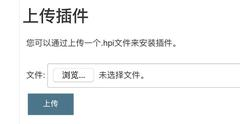
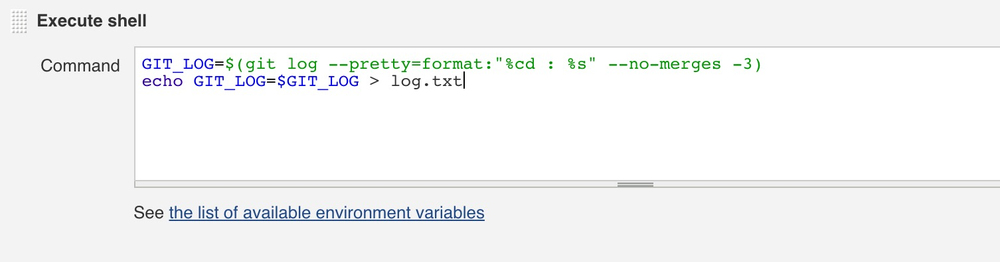
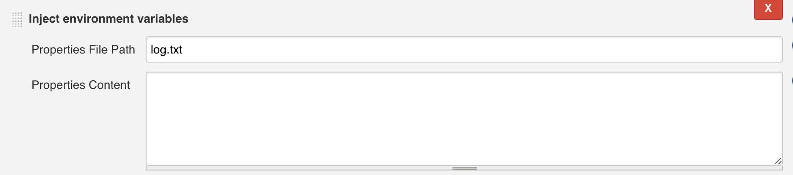

# Jenkins+fir 上传更新日志

 发表于 2017-07-17 | 更新于: 2018-11-06 | 分类于 [Jenkins](http://android9527.com/categories/Jenkins/)

 字数统计: 2k | 阅读时长 ≈ 9 分钟

#### 背景

在日常开发中持续集成可以节省开发者很多时间和精力，fir下载地址和邮件没有更新日志内容，这样无法通知测试人员具体修改内容，造成了很多不便，所以有了这个需求。

#### 步骤

前提：首先你得先折腾好打包工具吧，现在的教程都已经很多了

- 首先安装插件：Environment Injector Plugin (http://updates.jenkins-ci.org/download/plugins/envinject/) ，下载成功后打开`Jenkins->系统管理->管理插件->高级->拖至页面底部上传插件->选中文件点击上传`，提示成功后返回首页。

  

- 进入现有的项目，输出commit日志内容：`增加构建步骤->Execute shell`->在Command输入以下内容（注意替换username和password）：

```
  GIT_LOG=$(git log --pretty=format:"%cd : %s" --no-merges -3)
  echo GIT_LOG=$GIT_LOG > log.txt
```

  

- 设置commit日志保存路径：增加构建步骤->Inject environment variables->在Properties File Path输入log.txt。

  

- 获取到commit日志后发给fir:`增加构建后操作步骤->Upload to fir.im->在fir.im Token`中输入你从fir获得的token，然后在`Build Notes`中输入:
  $GIT_LOG

#### 自动获取git分支变化时构建项目,

在”`构建触发器`“中选择”`Build when a change is pushed to GitHub` “和”`Poll SCM` “，这两项的作用分别是当GitHub有版本库更新时触发Jenkins进行构建和定期检查版本库是否有更新，如果有更新则触发Jenkins进行构建。这里要注意Schedule语法，例如”`*/2 * * * *`“表示每隔2分钟检查一次。

#### Jenkins邮箱配置

1. Override Global Settings：如果不选，该插件将使用默认的E-mail Notification通知选项。反之，您可以通过指定不同于( 默认选项)的设置来进行覆盖。
2. Default Content Type：指定构建后发送邮件内容的类型，有Text和HTML两种.
3. Use List-ID Email Header：为所有的邮件设置一个List-ID的邮件信头，这样你就可以在邮件客户端使用过滤。它也能阻止邮件发件人大部分的自动回复(诸如离开办公室、休假等等)。你可以使用你习惯的任何名称或者ID号，但是他们必须符合如下其中一种格式(真实的ID必须要包含在<和>标记里)：
   <ci-notifications.company.org>
   Build Notifications <ci-notifications.company.org>
   “Build Notifications” <ci-notifications.company.org>
4. Add ‘Precedence: bulk’ Email Header：设置优先级,
5. Default Recipients：自定义默认电子邮件收件人列表。如果没有被项目配置覆盖,该插件会使用这个列表。您可以在项目配置使用$ DEFAULT_RECIPIENTS参数包括此默认列表，以及添加新的地址在项目级别。添加抄送：cc:电子邮件地址例如,CC:[someone@somewhere.com](mailto:someone@somewhere.com)
6. Reply To List：回复列表, A comma separated list of e-mail addresses to use in the Reply-To header of the email. This value will be available as $DEFAULT_REPLYTO in the project configuration.
7. Emergency reroute：如果这个字段不为空，所有的电子邮件将被单独发送到该地址（或地址列表）。
8. Excluded Committers：防止邮件被邮件系统认为是垃圾邮件,邮件列表应该没有扩展的账户名(如:@domain.com),并且使用逗号分隔
9. Default Subject：自定义邮件通知的默认主题名称。该选项能在邮件的主题字段中替换一些参数，这样你就可以在构建中包含指定的输出信息。
10. Maximum Attachment Size：邮件最大附件大小。
11. Default Content：自定义邮件通知的默认内容主体。该选项能在邮件的内容中替换一些参数，这样你就可以在构建中包含指定的输出信息。
12. Default Pre-send Script：默认发送前执行的脚本（注：grooy脚本，这是我在某篇文章上看到的，不一定准确）。
13. Enable Debug Mode：启用插件的调试模式。这将增加额外的日志输出，构建日志以及Jenkins的日志。在调试时是有用的，但不能用于生产。
14. Enable Security：启用时，会禁用发送脚本的能力，直接进入Jenkins实例。如果用户试图访问Jenkins管理对象实例，将抛出一个安全异常。
15. Content Token Reference：邮件中可以使用的变量，所有的变量都是可选的。

项目基本配置参数说明：
当插件激活后你就能编辑如下字段（只列出常用的字段）：

```
Project Recipient List：这是一个以逗号(或者空格)分隔的收件人邮件的邮箱地址列表。允许您为每封邮件指定单独的列表。Ps：如果你想在默认收件人的基础上添加收件人：$DEFAULT_RECIPIENTS,<新的收件人>
Default Subject：允许你配置此项目邮件的主题。
Default Content：跟Default Subject的作用一样，但是是替换邮件内容。
Attach Build Log：附件构建日志。
Compress Build Log before sending：发送前压缩生成日志（zip格式）。
```


#### 附email-ext邮件通知模板

发现一个很好的邮件通知模板，如下：

Default Subject：

构建通知:${BUILD_STATUS} - ${PROJECT_NAME} - Build # ${BUILD_NUMBER} !
Default Content：

```
<!DOCTYPE html>
<html>
<head>
<meta charset="UTF-8">
<title>${ENV, var="JOB_NAME"}-第${BUILD_NUMBER}次构建日志</title>
</head>

<body leftmargin="8" marginwidth="0" topmargin="8" marginheight="4"
    offset="0">
    <table width="95%" cellpadding="0" cellspacing="0"
        style="font-size: 11pt; font-family: Tahoma, Arial, Helvetica, sans-serif">
        <tr>
            <td>(本邮件是程序自动下发的，请勿回复！)</td>
        </tr>
        <tr>
            <td><h2>
                    <font color="#0000FF">构建结果 - ${BUILD_STATUS}</font>
                </h2></td>
        </tr>
        <tr>
            <td><br />
            <b><font color="#0B610B">构建信息</font></b>
            <hr size="2" width="100%" align="center" /></td>
        </tr>
        <tr>
            <td>
                <ul>
                    <li>项目名称&nbsp;：&nbsp;${PROJECT_NAME}</li>
                    <li>构建编号&nbsp;：&nbsp;第${BUILD_NUMBER}次构建</li>
                    <li>SVN&nbsp;版本：&nbsp;${SVN_REVISION}</li>
                    <li>触发原因：&nbsp;${CAUSE}</li>
                    <li>构建日志：&nbsp;<a href="${BUILD_URL}console">${BUILD_URL}console</a></li>
                    <li>构建&nbsp;&nbsp;Url&nbsp;：&nbsp;<a href="${BUILD_URL}">${BUILD_URL}</a></li>
                    <li>工作目录&nbsp;：&nbsp;<a href="${PROJECT_URL}ws">${PROJECT_URL}ws</a></li>
                    <li>项目&nbsp;&nbsp;Url&nbsp;：&nbsp;<a href="${PROJECT_URL}">${PROJECT_URL}</a></li>
                </ul>
            </td>
        </tr>
        <tr>
            <td><b><font color="#0B610B">Changes Since Last
                        Successful Build:</font></b>
            <hr size="2" width="100%" align="center" /></td>
        </tr>
        <tr>
            <td>
                <ul>
                    <li>历史变更记录 : <a href="${PROJECT_URL}changes">${PROJECT_URL}changes</a></li>
                </ul> ${CHANGES_SINCE_LAST_SUCCESS,reverse=true, format="Changes for Build #%n:<br />%c<br />",showPaths=true,changesFormat="<pre>[%a]<br />%m</pre>",pathFormat="&nbsp;&nbsp;&nbsp;&nbsp;%p"}
            </td>
        </tr>
        <tr>
            <td><b>Failed Test Results</b>
            <hr size="2" width="100%" align="center" /></td>
        </tr>
        <tr>
            <td><pre
                    style="font-size: 11pt; font-family: Tahoma, Arial, Helvetica, sans-serif">$FAILED_TESTS</pre>
                <br /></td>
        </tr>
        <tr>
            <td><b><font color="#0B610B">构建日志 (最后 100行):</font></b>
            <hr size="2" width="100%" align="center" /></td>
        </tr>
        <!-- <tr>
            <td>Test Logs (if test has ran): <a
                href="${PROJECT_URL}ws/TestResult/archive_logs/Log-Build-${BUILD_NUMBER}.zip">${PROJECT_URL}/ws/TestResult/archive_logs/Log-Build-${BUILD_NUMBER}.zip</a>
                <br />
            <br />
            </td>
        </tr> -->
        <tr>
            <td><textarea cols="80" rows="30" readonly="readonly"
                    style="font-family: Courier New">${BUILD_LOG, maxLines=100}</textarea>
            </td>
        </tr>
    </table>
</body>
</html>
```

#### 参考资料：

[Jenkins+fir 上传更新日志](http://www.jianshu.com/p/c3c769c5b8f2)
[Jenkins 邮件配置](http://www.cnblogs.com/yangxia-test/p/4366172.html)