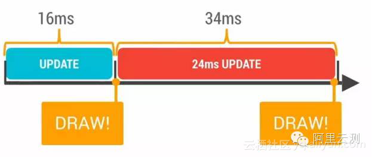
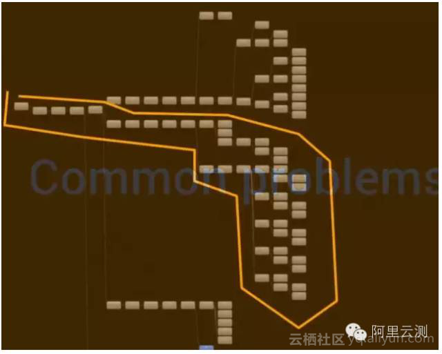

# Android界面性能调优手册

#### 摘要

界面是 Android 应用中直接影响用户体验最关键的部分。如果代码实现得不好，界面容易发生卡顿且导致应用占用大量内存。

<!-- more -->

#### Android渲染知识

##### 1.1 绘制原理

Android系统要求每一帧都要在 16ms 内绘制完成，平滑的完成一帧意味着任何特殊的帧需要执行所有的渲染代码（包括 framework 发送给 GPU 和 CPU 绘制到缓冲区的命令）都要在 16ms 内完成，保持流畅的体验。这个速度允许系统在动画和输入事件的过程中以约 60 帧每秒（ 1秒 / 0.016帧每秒 = 62.5帧/秒 ）的平滑帧率来渲染。
[draw](../../../images/draw/draw_1.png)

如果你的应用没有在 16ms 内完成这一帧的绘制，假设你花了 24ms 来绘制这一帧，那么就会出现掉帧的情况。

系统准备将新的一帧绘制到屏幕上，但是这一帧并没有准备好，所有就不会有绘制操作，画面也就不会刷新。反馈到用户身上，就是用户盯着同一张图看了 32ms 而不是 16ms ，也就是说掉帧发生了。

##### 1.2 掉帧

掉帧是用户体验中一个非常核心的问题。丢弃了当前帧，并且之后不能够延续之前的帧率，这种不连续的间隔会容易会引起用户的注意，也就是我们常说的卡顿、不流畅。

引起掉帧的原因非常多，比如：

- 花了非常多时间重新绘制界面中的大部分东西，这样非常浪费CPU周期；
  
- 过度绘制严重，在绘制用户看不到的对象上花费了太多的时间
- 有一大堆动画重复了一遍又一遍，消耗 CPU 、 GPU 资源；
- 频繁的触发垃圾回收；

##### 1.3 为什么是60Fps？

Android系统要求每一帧都要在 16ms 内绘制完成，那么1秒的帧率就是约 60 帧每秒（ 1秒 / 0.016帧每秒 = 62.5帧/秒 ），那为什么要以 60 Fps来作为 App 性能的衡量标准呢？这是因为人眼和大脑之间的协作无法感知到超过 60 Fps的画面更新。

市面上绝大多数Android设备的屏幕刷新频率是 60 HZ。当然，超过 60 Fps 是没有意义的，人眼感知不到区别。24 Fps 是人眼能感知的连续线性的运动，所以是电影胶圈的常用帧率，因为这个帧率已经足够支撑大部分电影画面所要表达的内容，同时能最大限度地减少费用支出。但是，低于 30 Fps 是无法顺畅表现绚丽的画面内容的，此时就需要用到 60 Fps 来达到想要表达的效果。

应用的界面性能目标就是保持 60 Fps，这意味着每一帧你只有 16 ms（1秒 / 60帧率）的时间来处理所有的任务。

##### 1.4 垃圾回收

垃圾回收器是一个在应用运行期间自动释放那些不再引用的内存的机制，常称 GC 。频繁的 GC 也是导致严重性能问题的罪魁祸首之一。
前面提到，平滑的完成一帧意味着所有渲染代码都必须在 16ms 内完成。频繁的 GC 会严重限制一帧时间内的剩余时间，如果 GC 所做的工作超过了那些必须的工作，那么留给应用平滑的帧率的时间就越少。越接近 16ms ，在垃圾回收事件触发的时候，就越容易导致卡顿。

注意，Android4.4 引进了新的 ART 虚拟机来取代 Dalvik 虚拟机。它们的机制大有不同，简单而言：

- Dalvik 虚拟机的 GC 是非常耗资源的，并且在正常的情况下一个硬件性能不错的Android设备也会很容易耗费掉 10 – 20 ms 的时间；
- ART 虚拟机的GC会动态提升垃圾回收的效率，在 ART 中的中断，通常在 2 – 3 ms 间。 比 Dalvik 虚拟机有很大的性能提升；
  ART 虚拟机相对于 Dalvik 虚拟机来说的垃圾回收来说有一个很大的性能提升，但 2 – 3 ms 的回收时间对于超过16ms帧率的界限也是足够的。因此，尽管垃圾回收在 Android 5.0 之后不再是耗资源的行为，但也是始终需要尽可能避免的，特别是在执行动画的情况下，可能会导致一些让用户明显感觉的丢帧。

##### 1.5 UI 线程

UI 线程是应用的主线程，很多的性能和卡顿问题是由于我们在主线程中做了大量的工作。
所以，所有耗资源的操作，比如 IO 操作、网络操作、SQL 操作、列表刷新等，都应该用后台进程去实现，不能占用主线程，主线程是 UI 线程，是保持程序流畅的关键；
在 Android 5.0 版本里，Android 框架层引入了 “ Render Thread ” ，用于向 GPU 发送实际渲染的操作。这个线程减轻了一些 UI 线程减少的操作。但是输入、滚动和动画仍然在 UI thread，因为 Thread 必须能够响应操作。

##### 1.6 垂直同步

垂直同步是 Android4.1 通过 Project Butter 在 UI 架构中引入的新技术，同期引入的还有 Triple Buffer 和 HWComposer 等技术，都是为提高 UI 的流畅性而生。

举个例子，你拍了一张照片，然后旋转5度再拍另外一张照片，将两照片的中间剪开并拼接在一起，得到下图：
中间这部分有明显区别的部分，等价于设备刷新率和帧速率不一致的结果。

一般而言， GPU 的帧速率应高于刷新率，才不会卡顿或掉帧。如果屏幕刷新率比帧速率还快，屏幕会在两帧中显示同一个画面，这种断断续续情况持续发生时，用户将会很明显地感觉到动画的卡顿或者掉帧，然后又恢复正常，我们常称之为闪屏、跳帧、延迟。应用应避免这些帧率下降的情况，以确保 GPU 能在屏幕刷新之前完成数据的获取及写入，保证动画流畅。

##### 1.7 UI 绘制机制与栅格化

绝大多数渲染操作都依赖两个硬件： CPU 、 GPU 。 CPU 负责 Measure 、 layout 、 Record 、 Execute 的计算操作， GPU 负责栅格化（ Rasterization ）操作。 非必需的视图组件会带来多余的 CPU 计算操作，还会占用多余的 GPU 资源。

栅格化（ Rasterization ）能将 Button 、 Shape 、 Path 、 Bitmap 等资源组件拆分到不同的像素上进行显示。这个操作很费时，所以引入了 GPU 来加快栅格化的操作。

CPU 负责把 UI 组件计算成多边形（ Polygons ），纹理（ Texture ），然后交给 GPU 进行栅格化渲染，再将处理结果传到屏幕上显示

在 Android 里的那些资源组件的显示（比如 Bitmaps 、 Drawable ），都是一起打包到统一的纹理（ Texture ）当中，然后再传递到 GPU 里面。

图片的显示，则是先经过 CPU 的计算加载到内存中，再传给 GPU 进行渲染。文字的显示，则是先经过 CPU 换算成纹理（ Texture ），再传给 GPU 进行渲染，返回到 CPU 绘制单个字符的时候，再重新引用经过 GPU 渲染的内容。动画的显示更加复杂，我们需要在 16 ms 内处理完所有 CPU 和 GPU 的计算、绘制、渲染等操作，才能获得应用的流畅体验。

#### 二. To检测和解决

##### 2.1 检测维度

根据业务的不同与所需要的测试粒度的不同，就会有不同的检测维度。目前我所在业务所需的界面性能检测维度如下：

- 界面过度绘制；（检测过度绘制）
- 渲染性能；（检测严格模式下的UI渲染性能呈现）
- 布局边界合理性；（检测元素显示的合理性）
- 还有专项测试中某些用户场景可能还包含着另外一些隐形的检测维度，比如：
- OpenGL 跟踪分析；
- GPU 视图更新合理性；
- Flash 硬件层更新合理性；
- 动画加 / 减速状态问题点检测；
- ……

##### 2.2 调试工具

检测和解决界面性能问题很大程度上依赖于你的应用程序架构，幸运的是，Andorid 提供了很多调试工具，知道并学会使用这些工具很重要，它们可以帮助我们调试和分析界面性能问题，以让应用拥有更好的性能体验。下面列举Android常见的界面性能调试工具：

###### 2.2.1 Hierarchy View

Hierarchy View 在Android SDK里自带，常用来查看界面的视图结构是否过于复杂，用于了解哪些视图过度绘制，又该如何进行改进

###### 2.2.2 Lint

Lint 是 ADT 自带的静态代码扫描工具，可以给 XML 布局文件和 项目代码中不合理的或存在风险的模块提出改善性建议。官方关于 Lint 的实际使用的提示，列举几点如下：

- 包含无用的分支，建议去除；
- 包含无用的父控件，建议去除；
- 警告该布局深度过深；
- 建议使用 compound drawables ；
- 建议使用 merge 标签
- ……

###### 2.2.3 Systrace

Systrace 在Android DDMS 里自带，可以用来跟踪 graphics 、view 和 window 的信息，发现一些深层次的问题。很麻烦，限制大，实际调试中我基本用不到。

###### 2.2.4 Track

Track 在 Android DDMS里自带，是个很棒的用来跟踪构造视图的时候哪些方法费时，精确到每一个函数，无论是应用函数还是系统函数，我们可以很容易地看到掉帧的地方以及那一帧所有函数的调用情况，找出问题点进行优化。

###### 2.2.5 OverDraw

通过在 Android 设备的设置 APP 的开发者选项里打开 “ 调试 GPU 过度绘制 ” ，来查看应用所有界面及分支界面下的过度绘制情况，方便进行优化。

###### 2.2.6 GPU 呈现模式分析

通过在 Android 设备的设置 APP 的开发者选项里启动 “ GPU 呈现模式分析 ” ，可以得到最近 128 帧 每一帧渲染的时间，分析性能渲染的性能及性能瓶颈。

###### 2.2.7 StrictMode　　

通过在 Android 设备的设置 APP 的开发者选项里启动 “ 严格模式 ” ，来查看应用哪些操作在主线程上执行时间过长。当一些操作违背了严格模式时屏幕的四周边界会闪烁红色，同时输出 StrictMode 的相关信息到 LOGCAT 日志中。

###### 2.2.8 Animator duration scale　　

通过在 Android 设备的设置 APP 的开发者选项里打开 “ 窗口动画缩放 ” / “ 过渡动画缩放 ” / “ 动画程序时长缩放 ”，来加速或减慢动画的时间，以查看加速或减慢状态下的动画是否会有问题。

##### 2.3 如何解决　　

前面提到过我司的目前所需的测试维度如下：

- 界面过度绘制；（检测过度绘制）
- 渲染性能；（检测严格模式下的UI渲染性能呈现） 故接下来将围绕这两点，分别从概念、追踪、挖掘根源以及排查的工具来具体讲述如何解决，以及给开发的优化建议。

#### 三. 界面过度绘制（OverDraw）

##### 3.1 过度绘制概念

过度绘制是一个术语，表示某些组件在屏幕上的一个像素点的绘制次数超过 1 次。

通俗来讲，绘制界面可以类比成一个涂鸦客涂鸦墙壁，涂鸦是一件工作量很大的事情，墙面的每个点在涂鸦过程中可能被涂了各种各样的颜色，但最终呈现的颜色却只可能是 1 种。这意味着我们花大力气涂鸦过程中那些非最终呈现的颜色对路人是不可见的，是一种对时间、精力和资源的浪费，存在很大的改善空间。绘制界面同理，花了太多的时间去绘制那些堆叠在下面的、用户看不到的东西，这样是在浪费CPU周期和渲染时间！

官方例子，被用户激活的卡片在最上面,而那些没有激活的卡片在下面，在绘制用户看不到的对象上花费了太多的时间。

##### 3.2 追踪过度绘制

通过在 Android 设备的设置 APP 的开发者选项里打开 “ 调试 GPU 过度绘制 ” ，来查看应用所有界面及分支界面下的过度绘制情况，方便进行优化。

Android 会在屏幕上显示不同深浅的颜色来表示过度绘制：

- 没颜色：没有过度绘制，即一个像素点绘制了 1 次，显示应用本来的颜色；
- 蓝色：1倍过度绘制，即一个像素点绘制了 2 次；
- 绿色：2倍过度绘制，即一个像素点绘制了 3 次；
- 浅红色：3倍过度绘制，即一个像素点绘制了 4 次；
- 深红色：4倍过度绘制及以上，即一个像素点绘制了 5 次及以上； 设备的硬件性能是有限的，当过度绘制导致应用需要消耗更多资源（超过了可用资源）的时候性能就会降低，表现为卡顿、不流畅、ANR 等。为了最大限度地提高应用的性能和体验，就需要尽可能地减少过度绘制，即更多的蓝色色块而不是红色色块。 　　
  实际测试，常用以下两点来作为过度绘制的测试指标，将过度绘制控制在一个约定好的合理范围内：
- 应用所有界面以及分支界面均不存在超过4X过度绘制（深红色区域）；
- 应用所有界面以及分支界面下，3X过度绘制总面积（浅红色区域）不超过屏幕可视区域的1/4；

##### 3.3 过度绘制的根源

过度绘制很大程度上来自于视图相互重叠的问题，其次还有不必要的背景重叠。

官方例子，比如一个应用所有的View都有背景的话，就会看起来像第一张图中那样，而在去除这些不必要的背景之后（指的是Window的默认背景、Layout的背景、文字以及图片的可能存在的背景），效果就像第二张图那样，基本没有过度绘制的情况。

##### 3.4 不合理的xml布局对绘制的影响

当布局文件的节点树的深度越深，XML 中的标签和属性设置越多，对界面的显示有灾难性影响。

一个界面要显示出来，第一步会进行解析布局，在 requestLayout 之后还要进行一系列的 measure 、 layout 、 draw 操作，若布局文件嵌套过深、拥有的标签属性过于臃肿，每一步的执行时间都会受到影响，而界面的显示是进行完这些操作后才会显示的，所以每一步操作的时间增长，最终显示的时间就会越长。

##### 3.5 源码相关

有能力且有兴趣看源码的童鞋，过度绘制的源码位置在: /frameworks/base/libs/hwui/OpenGLRenderer.cpp ，有兴趣的可以去研究查看。

#### 四. 渲染性能（Rendering）

##### 4.1 渲染性能概念

渲染性能往往是掉帧的罪魁祸首，这种问题很常见，让人头疼。好在 Android 给我们提供了一个强大的工具，帮助我们非常容易追踪性能渲染问题，看到究竟是什么导致你的应用出现卡顿、掉帧。

##### 4.2 追踪渲染性能

通过在 Android 设备的设置 APP 的开发者选项里打开 “ GPU 呈现模式分析 ” 选项，选择 ” 在屏幕上显示为条形图 “ 。

这个工具会在Android 设备的屏幕上实时显示当前界面的最近 128 帧 的 GPU 绘制图形数据，包括 StatusBar 、 NavBar 、 当前界面的 GPU 绘制图形柱状图数据。我们一般只需关心当前界面的 GPU 绘制图形数据即可。

界面上一共有 128 个小柱状图，代表的是当前界面最近的 128 帧 GPU 绘制图形数据。一个小柱状图代表的这一帧画面渲染的耗时，柱状图越高代表耗时越长。随着界面的刷新，柱状图信息也会实时滚动刷新。

中间有一条绿线，代表 16 ms ，保持动画流畅的关键就在于让这些垂直的柱状条尽可能地保持在绿线下面,任何时候超过绿线,你就有可能丢失一帧的内容。

每一个柱状图都是由三种颜色构成：蓝、红、黄。

- 蓝色代表的是这一帧绘制 Display List 的时间。通俗来说，就是记录了需要花费多长时间在屏幕上更新视图。用代码语言来说，就是执行视图的 onDraw 方法，创建或更新每一个视图的 Display List 的时间。

- 红色代表的是这一帧 OpenGL 渲染 Display List 所需要的时间。通俗来说，就是记录了执行视图绘制的耗时。用代码语言来说，就是 Android 用 OpenGL ES 的 API 接口进行 2D 渲染 Display List 的时间。

- 黄色代表的是这一帧 CPU 等待 GPU 处理的时间。通俗来说，就是 CPU 等待 GPU 发出接到命令的回复的等待时间。用代码语言来说，就是这是一个阻塞调用。 　　
  实际测试，常用以下两点来作为渲染性能的测试指标，将渲染性能控制在一个约定好的合理范围内：

- 执行应用的所有功能及分支功能，操作过程中涉及的柱状条区域应至少 90 % 保持到绿线下面；

- 从用户体检的角度主观判断应用在 512 M 内存的 Android 设备下所有操作过程中的卡顿感是否能接受，不会感觉突兀怪异；

  ##### 4.3 渲染性能差的根源

当你看到蓝色的线较高的时候，可能是由于你的视图突然无效了需要重新绘制，或者是自定义的视图过于复杂耗时过长。

当你看到红色的线较高的时候，可能是由于你的视图重新提交了需要重新绘制导致的（比如屏幕从竖屏旋转成横屏后当前界面重新创建），或者是自定义的视图很复杂，绘制起来很麻烦，导致耗时过长。比如下面这种视图：

当你看到黄色的线较高的时候，那就意味着你给 GPU 太多的工作，太多的负责视图需要 OpenGL 命令去绘制和处理，导致 CPU 迟迟没等到 GPU 发出接到命令的回复。

##### 4.4 检测说明

这个工具能够很好地帮助你找到渲染相关的问题，帮助你找到卡顿的性能瓶颈，追踪究竟是什么导致被测应用出现卡顿、变慢的情况，以便在代码层面进行优化。甚至让负责产品设计的人去改善他的设计，以获得良好的用户体验。

检测渲染性能时，常伴随着开启“ 严格模式 ” 查看应用哪些情景在 UI 线程（主线程）上执行时间过长。

另外有些强大但可能少用的工具在测试性能渲染时辅助分析，比如：

- HierarchyViewer：这个工具常用来查看界面的视图结构是否过于复杂，用于了解哪些视图过度绘制，又该如何进行改进；
- Tracer for OpenGL：这个工具收集了所有UI界面发给GPU的绘制命令。常用于辅助开发人员 DEBUG 、定位一些 HierarchyViewer 工具定位不了的疑难渲染细节问题。

#### 五. 给开发的界面优化 Advice

##### 5.1 优化布局的结构

布局结构太复杂，会减慢渲染的速度，造成性能瓶颈。我们可以通过以下这些惯用、有效的布局原则来优化：

- 避免复杂的View层级。布局越复杂就越臃肿，就越容易出现性能问题，寻找最节省资源的方式去展示嵌套的内容；

- 尽量避免在视图层级的顶层使用相对布局 RelativeLayout 。相对布局 RelativeLayout 比较耗资源，因为一个相对布局 RelativeLayout 需要两次度量来确保自己处理了所有的布局关系，而且这个问题会伴随着视图层级中的相对布局 RelativeLayout 的增多，而变得更严重；

- 布局层级一样的情况建议使用线性布局 LinearLayout 代替相对布局 RelativeLayout，因为线性布局 LinearLayout 性能要更高一些；确实需要对分支进行相对布局 RelativeLayout 的时候，可以考虑更优化的网格布局 GridLayout ，它已经预处理了分支视图的关系，可以避免两次度量的问题；

- 相对复杂的布局建议采用相对布局 RelativeLayout ，相对布局 RelativeLayout 可以简单实现线性布局 LinearLayout 嵌套才能实现的布局；

- 不要使用绝对布局 AbsoluteLayout ；

- 将可重复使用的组件抽取出来并用 标签进行重用。如果应用多个地方的 UI 用到某个布局，就将其写成一个布局部件，便于各个 UI 重用。

- 使用 merge 标签减少布局的嵌套层次。

- 去掉多余的不可见背景。有多层背景颜色的布局，只留最上层的对用户可见的颜色即可，其他用户不可见的底层颜色可以去掉，减少无效的绘制操作；

- 尽量避免使用 layout_weight 属性。使用包含 layout_weight 属性的线性布局 LinearLayout 每一个子组件都需要被测量两次，会消耗过多的系统资源。在使用 ListView 标签与 GridView 标签的时候，这个问题显的尤其重要，因为子组件会重复被创建。平分布局可以使用相对布局 RelativeLayout 里一个 0dp 的 view 做分割线来搞定，如果不行，那就……；

- 合理的界面的布局结构应是宽而浅，而不是窄而深；

  ##### 5.2 优化处理逻辑

- 按需载入视图。某些不怎么重用的耗资源视图，可以等到需要的时候再加载，提高UI渲染速度；

- 使用 ViewStub 标签来加载一些不常用的布局；

- 动态地 inflation view 性能要比用 ViewStub 标签的 setVisiblity 性能要好，当然某些功能的实现采用 ViewStub 标签更合适；

- 尽量避免不必要的耗资源操作，节省宝贵的运算时间；

- 避免在 UI 线程进行繁重的操作。耗资源的操作（比如 IO 操作、网络操作、SQL 操作、列表刷新等）耗资源的操作应用后台进程去实现，不能占用 UI 线程，UI 线程是主线程，主线程是保持程序流畅的关键，应该只操作那些核心的 UI 操作，比如处理视图的属性和绘制；

- 最小化唤醒机制。我们常用广播来接收那些期望响应的消息和事件，但过多的响应超过本身需求的话，会消耗多余的 Android 设备性能和资源。所以应该最小化唤醒机制，当应用不关心这些消失和事件时，就关闭广播，并慎重选择那些要响应的 Intent 。

- 为低端设备考虑，比如 512M 内存、双核 CPU 、低分辨率，确保你的应用可以满足不同水平的设备。

- 优化应用的启动速度。当应用启动一个应用时，界面的尽快反馈显示可以给用户一个良好的体验。为了启动更快，可以延迟加载一些 UI 以及避免在应用 Application 层级初始化代码。

  ##### 5.3 善用 DEBUG 工具

- 多使用Android提供的一些调试工具去追踪应用主要功能的性能情况；

- 多使用Android提供的一些调试工具去追踪应用主要功能的内存分配情况；

ps：本文转载自听云博客

#### 参考

[Android界面性能调优手册](https://yq.aliyun.com/articles/152066?spm=5176.8067842.tagmain.57.1K9u3l&do=login)