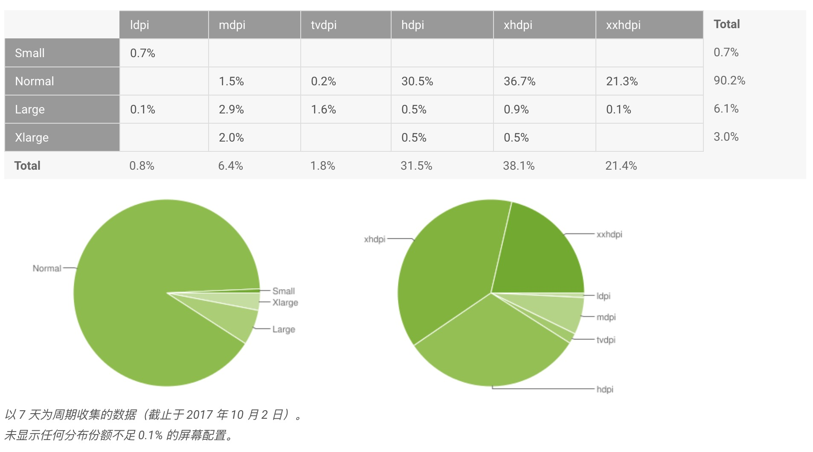
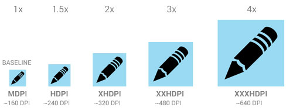
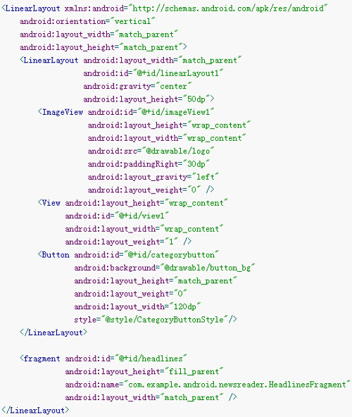
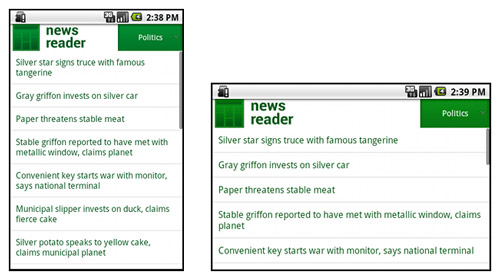
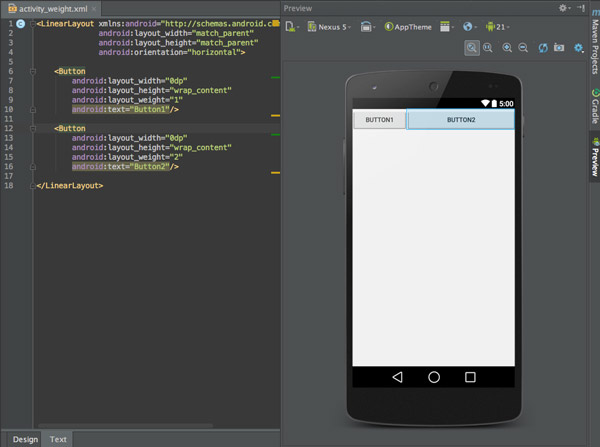
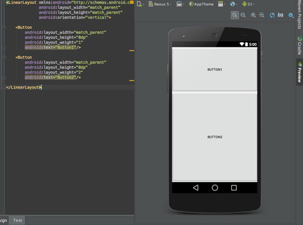
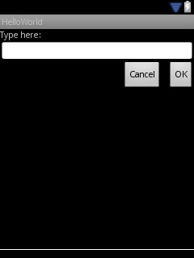
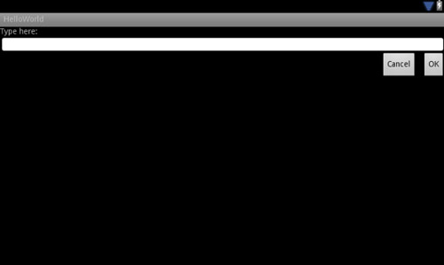
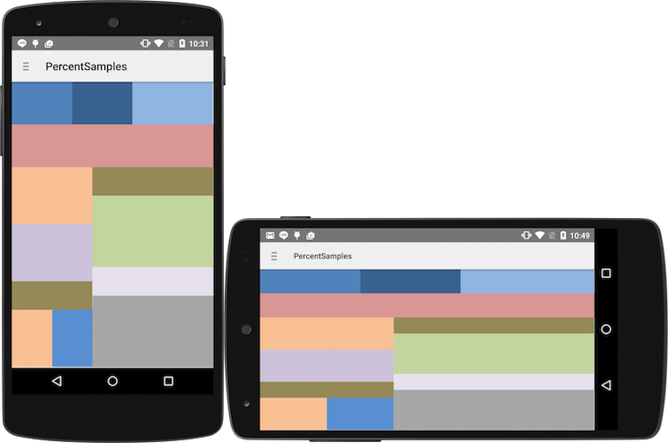
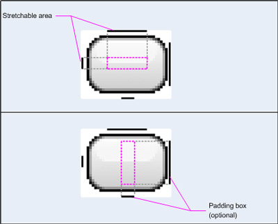

# Android多屏幕设计

#### 摘要

Android 可在各种具有不同屏幕尺寸和密度的设备上运行。对于应用，Android 系统在不同设备中提供一致的开发环境，可以处理大多数工作，将每个应用的用户界面调整为适应其显示的屏幕。 同时，系统提供 API，可用于控制应用适用于特定屏幕尺寸和密度的 UI，以针对不同屏幕配置优化 UI 设计。 例如，您可能想要不同于手机 UI 的平板电脑 UI。

虽然系统为使您的应用适用于不同的屏幕，会进行缩放和大小调整，但您应针对不同的屏幕尺寸和密度优化应用。 这样可以最大程度优化所有设备上的用户体验，用户会 认为您的应用实际上是专为他们的设备而设计，而不是 简单地拉伸以适应其设备屏幕。

<!-- more -->

#### 术语和概念

##### 屏幕尺寸

屏幕尺寸指屏幕的对角线的长度，单位是英寸，1英寸=2.54厘米

比如常见的屏幕尺寸有4.0、5.0、5.5、6.0等

为简便起见，Android 将所有实际屏幕尺寸分组为四种通用尺寸：小、 正常、大和超大。

- 超大屏幕至少为 960dp x 720dp
- 大屏幕至少为 640dp x 480dp
- 正常屏幕至少为 470dp x 320dp
- 小屏幕至少为 426dp x 320dp



##### 分辨率

屏幕上物理像素的总数。单位是px，1px=1个像素点。一般以纵向像素*横向像素，如1960*1080。
添加对多种屏幕的支持时， 应用不会直接使用分辨率；而只应关注通用尺寸和密度组指定的屏幕尺寸及密度。

##### 屏幕密度 (dpi)

屏幕像素密度是指每英寸上的像素点数，单位是dpi，即“dot per inch”的缩写。屏幕像素密度与屏幕尺寸和屏幕分辨率有关，在单一变化条件下，屏幕尺寸越小、分辨率越高，像素密度越大，反之越小。
为简便起见，Android 将所有屏幕密度分组为六种通用密度： 低、中、高、超高、超超高和超超超高。

##### 方向

从用户视角看屏幕的方向，即横屏还是 竖屏，分别表示屏幕的纵横比是宽还是高。请注意， 不仅不同的设备默认以不同的方向操作，而且 方向在运行时可随着用户旋转设备而改变。

##### 密度无关像素 (dip)

是Density independent pixel的缩写，指的是抽象意义上的像素。跟设备的屏幕密度有关系。
在定义 UI 布局时应使用的虚拟像素单位，用于以密度无关方式表示布局维度 或位置。
密度无关像素等于 160 dpi 屏幕上的一个物理像素，这是 系统为“中”密度屏幕假设的基线密度。在运行时，系统 根据使用中屏幕的实际密度按需要以透明方式处理 dp 单位的任何缩放 。dp 单位转换为屏幕像素很简单： px = dp * (dpi / 160)。 例如，在 240 dpi 屏幕上，1 dp 等于 1.5 物理像素。在定义应用的 UI 时应始终使用 dp 单位 ，以确保在不同密度的屏幕上正常显示 UI。

##### dp、dip、dpi、sp、px

px我们应该是比较熟悉的，前面的分辨率就是用的像素为单位，大多数情况下，比如UI设计、Android原生API都会以px作为统一的计量单位，像是获取屏幕宽高等。

dip和dp是一个意思，都是Density Independent Pixels的缩写，即密度无关像素，上面我们说过，dpi是屏幕像素密度，假如一英寸里面有160个像素，这个屏幕的像素密度就是160dpi，那么在这种情况下，dp和px如何换算呢？在Android中，规定以160dpi为基准，1dip=1px，如果密度是320dpi，则1dip=2px，以此类推。

假如同样都是画一条320px的线，在480*800分辨率手机上显示为2/3屏幕宽度，在320*480的手机上则占满了全屏，如果使用dp为单位，在这两种分辨率下，160dp都显示为屏幕一半的长度。这也是为什么在Android开发中，写布局的时候要尽量使用dp而不是px的原因。

而sp，即scale-independent pixels，与dp类似，但是可以根据文字大小首选项进行放缩，是设置字体大小的御用单位。

##### 支持的屏幕范围

从 Android 1.6（API 级别 4）开始，Android 支持多种屏幕尺寸和密度，反映设备可能具有的多种不同屏幕配置。 您可以使用 Android 系统的功能优化应用在各种屏幕配置下的用户界面 ，确保应用不仅正常渲染，而且在每个屏幕上提供 最佳的用户体验。

为简化您为多种屏幕设计用户界面的方式，Android 将实际屏幕尺寸和密度的范围 分为：
几种通用的密度：

- mdpi（中）120dpi~160dpi
- hdpi（高）160dpi~240dpi
- xhdpi（超高）240dpi~320dpi
- xxhdpi（超超高）320dpi~480dpi
- xxxhdpi（超超超高）480dpi~640dpi

要针对不同的屏幕尺寸和密度优化应用的 UI，可为任何通用的尺寸和密度提供备用资源。 通常，应为某些不同的屏幕尺寸提供替代布局，为不同的屏幕密度提供替代位图图像。 在运行时，系统会根据当前设备屏幕的通用 尺寸或密度对应用使用适当的资源。

无需为屏幕尺寸和 密度的每个组合提供备用资源。系统提供强大的兼容性功能，可处理在任何设备屏幕上 渲染应用的大多数工作，前提是您已经使用 可以适当调整大小的技术实现 UI（如下面的最佳做法所述）。

在设计图标时，对于五种主流的像素密度（mdpi、hdpi、xhdpi、xxhdpi 和 xxxhdpi）应按照 1:1.5:2:3:4 的比例进行缩放。



##### 密度独立性

应用显示在密度不同的屏幕上时，如果它保持用户界面元素的物理尺寸（从 用户的视角），便可实现“密度独立性” 。

保持密度独立性很重要，因为如果没有此功能，UI 元素（例如 按钮）在低密度屏幕上看起来较大，在高密度屏幕上看起来较小。这些 密度相关的大小变化可能给应用布局和易用性带来问题。图 2 和 3 分别显示了应用不提供密度独立性和 提供密度独立性时的差异。

Android 系统可帮助您的应用以两种方式实现密度独立性：

- 系统根据当前屏幕密度扩展 dp 单位数
- 系统在必要时可根据当前屏幕 密度将可绘制对象资源扩展到适当的大小

大多数情况下，确保应用中的屏幕独立性很简单，只需以适当的密度独立像素（dp 单位）或 “wrap_content” 指定所有 布局尺寸值。系统然后根据适用于当前屏幕密度的缩放比例适当地缩放位图可绘制对象，以 适当的大小显示。

但位图缩放可能导致模糊或像素化位图，您或许已经在上面的屏幕截图中 发现了这些问题。为避免这些伪影，应为 不同的密度提供替代的位图资源。例如，应为高密度 屏幕提供分辨率较高的位图，然后系统对中密度 屏幕将使用这些位图，而无需调整位图大小。下一节详细说明如何为 不同的屏幕配置提供备用资源。

#### 主要解决方案

#### (1)支持不同屏幕尺寸

介绍如何让设计的布局能够适应多种不同的屏幕尺寸（为视图、 RelativeLayout、屏幕尺寸和屏幕方向限定符、别名过滤器和九宫格位图使用灵活的尺寸）。

#### (2)支持不同屏幕密度

介绍如何支持具有不同像素密度的屏幕（使用密度无关像素并提供与每一种密度相适的位图）。

#### (3)实现自适应用户界面

介绍如何让实现的 UI 流自行适应多种屏幕尺寸/密度组合（运行时检测活动布局、根据当前布局作出反应、处理屏幕配置变更）。

Android 支持多种屏幕的基础是它能够管理针对当前屏幕配置 以适当方式渲染应用的布局和位图 可绘制对象。系统可处理大多数工作，通过适当地 缩放布局以适应屏幕尺寸/密度和根据屏幕密度缩放位图可绘制对象 ，在每种屏幕配置中渲染您的应用。但是，为了更适当地处理不同的屏幕配置 ，还应该：

##### 一、支持不同屏幕尺寸

###### 1. 在清单中显式声明声明屏幕尺寸支持

通过声明您的应用支持哪些屏幕尺寸，可确保只有 其屏幕受支持的设备才能下载您的应用。声明对 不同屏幕尺寸的支持也可影响系统如何在较大 屏幕上绘制您的应用 — 特别是，您的应用是否在屏幕兼容模式中运行。
要声明应用支持的屏幕尺寸，应在清单文件中包含 元素。

```
<supports-screens android:smallScreens=["true" | "false"]
                  android:normalScreens=["true" | "false"]
                  android:largeScreens=["true" | "false"]
                  android:xlargeScreens=["true" | "false"]
                  android:anyDensity=["true" | "false"]
                  android:requiresSmallestWidthDp="integer"
                  android:compatibleWidthLimitDp="integer"
                  android:largestWidthLimitDp="integer"/>
```

在对不同的屏幕尺寸实现您的布局后，在 清单文件中声明您的应用支持哪些屏幕相当重要。

与用于屏幕尺寸的新配置限定符一起，Android 3.2 为 清单元素引入了新的属性：

android:requiresSmallestWidthDp
指定需要的最小 smallestWidth。smallestWidth 是必须为您的应用 UI 提供的 屏幕空间的最短尺寸（dp 单位）—即 可用屏幕的两个尺寸中的最短者。因此，为使设备 与您的应用兼容，设备的 smallestWidth 必须等于或大于此 值。（通常，无论屏幕的当前方向如何， 此值都是布局支持的“最小宽度”。）
例如，如果您的应用只用于最小可用宽度为 600dp 的平板电脑样式设备：

```
<manifest ... >
    <supports-screens android:requiresSmallestWidthDp="600" />
    ...
</manifest>
```

但是，如果您的应用支持 Android 支持的所有屏幕尺寸（小至 426dp x 320dp），则无需声明此属性，因为应用 需要的最小宽度就是任何设备上可以实现的最小宽度。

注意：Android 系统不关注此 属性，因为它不影响应用在运行时的行为，而是被用于 在服务（例如 Google Play）上过滤您的应用。但是， Google Play 目前不支持此属性用于过滤（在 Android 3.2 上），因此如果您的应用不支持 小屏幕，您应继续使用其他尺寸属性。

android:compatibleWidthLimitDp
此属性可让您指定用户支持的最大“最小宽度”，将屏幕兼容性模式用作 用户可选的功能 。如果设备可用屏幕的最小边大于您在这里的值， 用户仍可安装您的应用，但提议在屏幕兼容性模式下运行。默认 情况下，屏幕兼容性模式会停用，并且您的布局照例会调整大小以 适应屏幕，但按钮会显示在系统栏中，可让用户打开和关闭屏幕兼容性 模式。
注：如果您的应用可针对大 屏幕正确调整大小，则无需使用此属性。建议不要使用此 属性，而是按照本文档的 建议，确保您的布局针对较大屏幕调整大小。

android:largestWidthLimitDp
此属性可让您指定应用支持的最大“最小宽度”来强制启用屏幕兼容性模式。 如果设备可用屏幕的最小 边大于您在这里的值，应用将在屏幕 兼容性模式下运行，且用户无法停用该模式。
注：如果您的应用可针对大 屏幕正确调整大小，则无需使用此属性。建议不要使用此 属性，而是按照本文档的 建议，确保您的布局针对较大屏幕调整大小。

注意：针对 Android 3.2 及更高版本开发时，您 应改为将旧屏幕尺寸属性与上列 属性结合使用。同时使用新属性和旧尺寸属性可能导致 非预期的行为。

如需了解每个属性的更多信息，请跟随上面各自的链接。

###### 2. 线性布局LinearLayout

使用`wrap_content`、`match_parent`、`layout_weight` 等属性和值

要确保布局的灵活性并适应各种尺寸的屏幕，应使用 “wrap_content” 和 “match_parent” 控制某些视图组件的宽度和高度。

使用 “wrap_content”，系统就会将视图的宽度或高度设置成所需的最小尺寸以适应视图中的内容，而 “match_parent”（在低于 API 级别 8 的级别中称为 “fill_parent”）则会展开组件以匹配其父视图的尺寸。

如果使用 “wrap_content” 和 “match_parent” 尺寸值而不是硬编码的尺寸，视图就会相应地仅使用自身所需的空间或展开以填满可用空间。此方法可让布局正确适应各种屏幕尺寸和屏幕方向。



下图是在横纵屏切换的时候的显示效果，我们可以看到这样可以很好的适配屏幕尺寸的变化。


`layout_weight`是线性布局的一个独特的属性，我们可以使用这个属性来按照比例对界面进行分配，完成一些特殊的需求。


我们在布局里面设置为线性布局，横向排列，然后放置两个宽度为0dp的按钮，分别设置weight为1和2，在效果图中，我们可以看到两个按钮按照1：2的宽度比例正常排列了，这也是我们经常使用到的场景，这是时候很好理解，Button1的宽度就是1/(1+2) = 1/3，Button2的宽度则是2/(1+2) = 2/3，我们可以很清楚的明白这种情景下的占比如何计算。

如果是垂直方向，那么我们应该改变的是layout_height的属性，下面是0dp的显示效果


###### 3. 使用相对布局RelativeLayout

在开发中，我们大部分时候使用的都是线性布局、相对布局和帧布局，绝对布局由于适配性极差，所以极少使用。

由于各种布局的特点不一样，所以不能说哪个布局好用，到底应该使用什么布局只能根据实际需求来确定。我们可以使用 LinearLayout 的嵌套实例并结合 “wrap_content” 和 “match_parent”，以便构建相当复杂的布局。不过，我们无法通过 LinearLayout 精确控制子视图的特殊关系；系统会将 LinearLayout 中的视图直接并排列出。

如果我们需要将子视图排列出各种效果而不是一条直线，通常更合适的解决方法是使用 RelativeLayout，这样就可以根据各组件之间的特殊关系指定布局了。例如，我们可以将某个子视图对齐到屏幕左侧，同时将另一个视图对齐到屏幕右侧。

在小尺寸屏幕的显示


在平板的大尺寸上的显示效果


虽然控件的大小由于屏幕尺寸的增加而发生了改变，但是我们可以看到，由于使用了相对布局，所以控件之前的位置关系并没有发生什么变化，这说明我们的适配成功了。

###### 4. 使用百分比布局 PercentRelativeLayout PercentFrameLayout

android-support-percent

app:layout_heightPercent=”20%”
app:layout_widthPercent=”70%”

app:layout_marginLeftPercent
app:layout_marginTopPercent
app:layout_marginRightPercent
app:layout_marginBottomPercent


###### 5. 使用约束布局 ConstraintLayout

###### 6. 为不同屏幕尺寸提供不同的布局

默认情况下，Android 会调整应用布局的大小以适应当前设备屏幕。大多数 情况下效果很好。但有时 UI 可能看起来不太好，需要针对 不同的屏幕尺寸进行调整。例如，在较大屏幕上，您可能要调整 某些元素的位置和大小，以利用其他屏幕空间，或者在较小屏幕上， 可能需要调整大小以使所有内容纳入屏幕。
可用于提供尺寸特定资源的配置限定符包括 small、normal、large 和 xlarge。例如，超大屏幕的布局应使用 layout-xlarge/。
从 Android 3.2（API 级别 13）开始，以上尺寸组已弃用，您 应改为使用 swdp 配置限定符来定义布局资源 可用的最小宽度。例如，如果多窗格平板电脑布局 需要至少 600dp 的屏幕宽度，应将其放在 layout-sw600dp/ 中。声明适用于 Android 3.2 的平板电脑布局一节将进一步讨论如何使用新技术声明布局资源。

###### 7. 使用资源限定符

Android 支持多种配置限定符，可让您控制系统 如何根据当前设备屏幕的特性选择备用资源。配置限定符是可以附加到 Android 项目中资源目录的字符串，用于指定在其中设计资源的配置。

要使用配置限定符：

在项目的 res/ 目录中新建一个目录，并使用以下 格式命名： <resources_name>-

<resources_name> 是标准资源名称（例如 drawable 或 layout）。

是下表 1 中的配置限定符，用于指定 要使用这些资源的屏幕配置（例如 hdpi 或 xlarge）。
您可以一次使用多个 — 只需使用短划线分隔每个 限定符。
将适当的配置特定资源保存在此新目录下。这些资源 文件的名称必须与默认资源文件完全一样。
例如，xlarge 是超大屏幕的配置限定符。将 此字符串附加到资源目录名称（例如 layout-xlarge）时，它指向 要在具有超大屏幕的设备上使用这些资源的系统。

表 1. 可用于为 不同屏幕配置提供特殊资源的配置限定符。


请注意，当 Android 系统在运行时选择使用哪些资源时，它会使用 特定逻辑确定“最佳匹配”资源。也就是说，您使用的限定符无 需在所有情况下精确匹配当前屏幕配置，系统也可 使用它们。特别是，根据屏幕尺寸限定符选择资源时，如果没有更好的匹配资源，则系统将 使用专为小于当前屏幕的屏幕而设计的 资源（例如，如有必要，大尺寸屏幕将使用标准尺寸的屏幕 资源）。但是，如果唯一可用的资源大于当前屏幕， 则系统不会使用这些资源，并且如果没有其他资源与设备 配置匹配，应用将会崩溃（例如，如果所有布局资源均用 xlarge 限定符标记， 但设备是标准尺寸的屏幕）

- 使用尺寸限定符

虽然这些布局可以拉伸组件内外的空间以适应各种屏幕，但它们不一定能为每种屏幕都提供最佳的用户体验。因此，我们的应用不仅仅只实施灵活布局，还应该应针对各种屏幕配置提供一些备用布局。

如何做到这一点呢？我们可以通过使用配置限定符，在运行时根据当前的设备配置自动选择合适的资源了，例如根据各种屏幕尺寸选择不同的布局。

很多应用会在较大的屏幕上实施“双面板”模式，即在一个面板上显示项目列表，而在另一面板上显示对应内容。平板电脑和电视的屏幕已经大到可以同时容纳这两个面板了，但手机屏幕就需要分别显示。因此，我们可以使用以下文件以便实施这些布局：

res/layout/main.xml，单面板（默认）布局：

res/layout-large/main.xml，双面板布局：

- 使用最小宽度限定符

最小宽度限定符可让您通过指定某个最小宽度（以 dp 为单位）来定位屏幕。例如，标准 7 英寸平板电脑的最小宽度为 600 dp，因此如果您要在此类屏幕上的用户界面中使用双面板（但在较小的屏幕上只显示列表），您可以使用上文中所述的单面板和双面板这两种布局，但您应使用 sw600dp 指明双面板布局仅适用于最小宽度为 600 dp 的屏幕，而不是使用 large 尺寸限定符。

res/layout-sw600dp/main.xml，双面板布局： smallestWidth

也就是说，对于最小宽度大于等于 600 dp 的设备，系统会选择 layout-sw600dp/main.xml（双面板）布局，否则系统就会选择 layout/main.xml（单面板）布局。

- 使用布局别名

最小宽度限定符仅适用于 Android 3.2 及更高版本。因此，如果我们仍需使用与较低版本兼容的概括尺寸范围（小、正常、大和特大）。例如，如果要将用户界面设计成在手机上显示单面板，但在 7 英寸平板电脑、电视和其他较大的设备上显示多面板，那么我们就需要提供以下文件：

res/layout/main.xml: 单面板布局
res/layout-large: 多面板布局
res/layout-sw600dp: 多面板布局
后两个文件是相同的，因为其中一个用于和 Android 3.2 设备匹配，而另一个则是为使用较低版本 Android 的平板电脑和电视准备的。

要避免平板电脑和电视的文件出现重复（以及由此带来的维护问题），您可以使用别名文件。例如，您可以定义以下布局：

res/layout/main.xml，单面板布局
res/layout/main_twopanes.xml，双面板布局
然后添加这两个文件：

res/values-large/layout.xml:

```
<resources>
    <item name="main_layout" type="layout">@layout/twopanes</item>
    <bool name="has_two_panes">true</bool>
</resources>
```

res/values-sw600dp/layout.xml:

```
<resources>
    <item name="main_layout" type="layout">@layout/twopanes</item>
    <bool name="has_two_panes">true</bool>
</resources>
```

它们只是将 main 设置成了twopanes 的别名。

- 使用屏幕方向限定符

values-large-land values-large-port

###### 8. 使用自动拉伸位图 .9图

支持不同屏幕尺寸通常意味着您的图像资源也必须能够适应不同的尺寸。 例如，按钮背景必须能够适应其所应用到的任何一种按钮形状。

如果您在可能改变尺寸的组件上使用简单图像，您很快会发现效果有些差强人意，因为运行组件会均匀地拉伸或缩小您的图像。 解决方案是使用九宫格位图，这种特殊格式的 PNG 文件会指示哪些区域可以拉伸，哪些区域不可以拉伸。

因此，在设计将用于尺寸可变组件的位图时，请一律使用九宫格位图。


###### 9. 使用矢量图

SVG是指可伸缩矢量图形 (Scalable Vector Graphics)，它不同于传统的位图，不是通过存储图像中每一点的像素值来保存与使用图形，而是通过 XML 文件来定义一个图形，通过一些特定的语法和规则来绘制出我们所需的图像——同样是使用一张图片，SVG 的方式是事先定义好怎么去画这个图，然后等要用的时候再把它去画出来，而使用传统的位图的话就是已经有了画出来的图，然后要用的时候直接把画好的图拿出来用。这样一来的话我们就很容易可以分析出它们两种方式之间的优劣之处：

- SVG 是在要用图的时候再把图画出来，所以理所当然的在图片显示的时候会花费更多的时间消耗更多的资源。
- 同样由于上一个原因， SVG并不太适合层次过于复杂细节过于繁多的图片。
- 位图是事先已经画好的图片，所以适应性必然没有 SVG 好，同一张图片在不同分辨率下显示会有差异。
- SVG 的文件里存储了绘制图片的相关信息，所以我们能够对图片的线条有一个非常清晰的感知，这在做动画的时候特别有用。
- SVG 没有存储任何图像的像素信息，所以 SVG 的文件体积远小于传统的位图文件。
- SVG 的文件画出来的图像是矢量图，所以不会存在失真的问题，理论上支持任何级别的缩放。

```
android {
    defaultConfig {
        vectorDrawables.useSupportLibrary = true
    }
}
dependencies {
  compile 'com.android.support:appcompat-v7:23.2.0'
}
```

##### 二、支持各种屏幕密度

###### 1. 使用非密度制约像素

由于各种屏幕的像素密度都有所不同，因此相同数量的像素在不同设备上的实际大小也有所差异，这样使用像素定义布局尺寸就会产生问题。因此，请务必使用 dp 或 sp 单位指定尺寸。

###### 2. 提供备用图片资源

由于运行 Android 的设备具有多种屏幕密度，您应始终提供能够根据各种通用密度级别（低密度、中密度、高密度和超高密度）进行定制的位图资源。这有助于您在所有屏幕密度上获得良好的图形质量和性能。

目标设备 xxhdpi

xxhdpi jpg解码
bmp.width —- > 1080
bmp.height —- > 1920
bmp.rowBytes * bmp.height —- > 4147200 4050KB

xhdpi

bmp.width —- > 1620 1.5
bmp.height —- > 2880 1.5
bmp.rowBytes * bmp.height —- > 9331200 2.25倍

hdpi 4倍

mdpi 9倍

基本上每个应用都应该具有不同密度的替代可绘制对象 资源，因为基本上每个应用都有启动器图标，而且该图标应该在 所有屏幕密度中看起来都很好。同样，如果您的应用中包含其他位图可绘制对象（例如 应用中的菜单图标或其他图形），则应该为不同密度提供替代版本或 每种密度一个版本。

默认情况下，Android 会缩放位图可绘制对象（.png、.jpg 和 .gif 文件）和九宫格可绘制对象（.9.png 文件），使它们以适当的 物理尺寸显示在每部设备上。例如，如果您的应用只为 基线中密度屏幕 (mdpi) 提供位图可绘制对象，则在高密度 屏幕上会增大位图，在低密度屏幕上会缩小位图。这种缩放可能在 位图中造成伪影。为确保位图的最佳显示效果，应针对 不同屏幕密度加入不同分辨率的替代版本。
可用于密度特定资源的配置限定符（在下面详述） 包括 ldpi（低）、mdpi（中）、 hdpi（高）、xhdpi（超高）、xxhdpi （超超高）和 xxxhdpi（超超超高）。例如，高密度屏幕的位图应使用 drawable-hdpi/。
注：仅当要在 xxhdpi 设备上提供比正常位图大的启动器图标时才需要提供 mipmap-xxxhdpi 限定符。无需为所有应用的图像提供 xxxhdpi 资源。

有些设备会将启动器图标增大 25%。例如，如果您的最高 密度启动器图标已是超超高密度，缩放处理会降低其 清晰度。因此应在 mipmap-xxxhdpi 目录中提供更高密度的启动器图标，系统将改为增大较小 的图标。
请参阅提供 xxx-高密度启动器图标以了解详细信息。对启动程序图标以外的 UI 元素不应使用 xxxhdpi 限定符。
注：将您的所有启动器图标放在 res/mipmap-[density]/ 文件夹中，而非 res/drawable-[density]/ 文件夹中。无论安装应用的设备屏幕分辨率如何，Android 系统都会将资源保留在这些密度特定的文件夹中，例如 mipmap-xxxhdpi。此 行为可让启动器应用为您的应用选择要显示在主 屏幕上的最佳分辨率图标。

尺寸和密度配置限定符对应于 前面支持的屏幕范围中所述的通用尺寸和密度。

在运行时，系统通过 以下程序确保任何给定资源在当前屏幕上都能保持尽可能最佳的显示效果：

- 系统使用适当的备用资源

  根据当前屏幕的尺寸和密度，系统将使用您的应用中提供的任何尺寸和 密度特定资源。例如，如果设备有 高密度屏幕，并且应用请求可绘制对象资源，系统将查找 与设备配置最匹配的可绘制对象资源目录。根据可用的其他 备用资源，包含 hdpi 限定符（例如 drawable-hdpi/）的资源目录可能是最佳匹配项，因此系统将使用此 目录中的可绘制对象资源。

- 如果没有匹配的资源，系统将使用默认资源，并按需要向上 或向下扩展，以匹配当前的屏幕尺寸和密度。

“默认”资源是指未标记配置限定符的资源。例如，drawable/ 中的资源是默认可绘制资源。 系统假设默认资源设计用于基线屏幕尺寸和密度，即 正常屏幕尺寸和中密度。 因此，系统对于高密度屏幕向上扩展默认密度 资源，对于低密度屏幕向下扩展。
当系统查找密度特定的资源但在 密度特定目录中未找到时，不一定会使用默认资源。系统在缩放时可能 改用其他密度特定资源提供更好的 效果。例如，查找低密度资源但该资源不可用时， 系统会缩小资源的高密度版本，因为 系统可轻松以 0.5 为系数将高密度资源缩小至低密度资源，与以 0.75 为系数 缩小中密度资源相比，伪影更少。
如需有关 Android 如何通过使配置限定符与设备配置匹配来选择备用资源的更多信息，请参阅Android 如何查找最佳匹配资源。

##### 三、实施自适应用户界面流程

UI 流可能视您的应用当前显示的布局而有所不同。例如，如果您的应用处于双窗格模式，点击左侧窗格中的某个项目会直接在右侧窗格中显示内容；如果是处于单窗格模式，内容应该会独立显示（在不同的 Activity 中）。

- 确定当前布局

由于您对每个布局的实现都略有差异，您需要优先完成的一项工作可能是确定用户目前查看的布局。 例如，您可能想了解用户是处于“单窗格”模式还是“双窗格”模式。 您可以通过查询给定视图是否存在并且是否可见来实现此目的：

```
public class NewsReaderActivity extends FragmentActivity {    

    // 标记当前面板类型    
    boolean mIsDualPane;
    @Override
    public void onCreate(Bundle savedInstanceState) {
        super.onCreate(savedInstanceState);
        setContentView(R.layout.main_layout);
        
        View articleView = findViewById(R.id.article);
        mIsDualPane = articleView != null &&
                        articleView.getVisibility() == View.VISIBLE;
    }
}
```

请注意，这段代码用于查询“article”面板是否可用，与针对具体布局的硬编码查询相比，这段代码的灵活性要大得多。

- 根据当前布局作出反应

某些操作可能视当前布局而有不同的结果。例如，在 News Reader 示例应用中，如果 UI 处于双窗格模式，则点击标题列表中的某个标题会在右侧窗格中打开该文章，但如果 UI 处于单窗格模式，则会启动不同的 Activity：

```
@Override
public void onHeadlineSelected(int index) {
    mArtIndex = index;
    if (mIsDualPane) {
        /* display article on the right pane */
        mArticleFragment.displayArticle(mCurrentCat.getArticle(index));
    } else {
        /* start a separate activity */
        Intent intent = new Intent(this, ArticleActivity.class);
        intent.putExtra("catIndex", mCatIndex);
        intent.putExtra("artIndex", index);
        startActivity(intent);
    }
}
```

- 在其他 Activity 中重复使用 Fragment

在面向多种屏幕的设计中采用的一种固定模式是，让界面的某一部分在一些屏幕配置下以窗格形式实现，在其他配置下则以一个单独 Activity 的形式实现。 例如，在 News Reader 示例应用中，新闻文章文字在较大屏幕上显示在右侧窗格中，但在较小屏幕上则显示在一个单独的 Activity 内。

在这类情况下，您通常可以通过在几个 Activity 中重复使用同一 Fragment 子类来避免代码重复。例如，双窗格布局中使用了 ArticleFragment：

并在适用于较小屏幕的 Activity 布局 (ArticleActivity) 中重复使用ArticleFragment

- 处理屏幕配置变更

如果您要使用不同的 Activity 来实现界面的不同部分，您需要牢记的是，可能需要对某些配置变更（如旋转变化）作出反应，以便保持界面的一致性。

例如，在一台运行 Android 3.0 或更高版本的典型 7 英寸平板电脑上，当平板电脑在纵向模式下运行时，News Reader 示例应用使用单独的 Activity 来显示新闻文章，但在横向模式下则使用双窗格布局。

这意味着当用户处于纵向模式，并且用于查看文章的 Activity 位于屏幕上时，您需要检测屏幕方向已变为横向模式的情况并作出相应的反应：结束该 Activity 并返回主 Activity，以便内容可以显示在双窗格布局中：

```
public class ArticleActivity extends FragmentActivity {
    int mCatIndex, mArtIndex;
        
    @Override
    protected void onCreate(Bundle savedInstanceState) {
        super.onCreate(savedInstanceState);
        mCatIndex = getIntent().getExtras().getInt("catIndex", 0);
        mArtIndex = getIntent().getExtras().getInt("artIndex", 0);

        // If should be in two-pane mode, finish to return to main activity
        if (getResources().getBoolean(R.bool.has_two_panes)) {
            finish();
            return;
        }
    }
}
```

#### 最佳做法

##### 1. 对布局尺寸使用 wrap_content、match_parent 或 dp 单位

为 XML 布局文件中的视图定义 android:layout_width 和 android:layout_height 时，使用 “wrap_content”、 “match_parent” 或 dp 单位可确保在当前设备屏幕上为 视图提供适当的尺寸。

例如，layout_width=”100dp” 的视图在 中密度屏幕上测出宽度为 100 像素，在高密度屏幕上系统会将其扩展至 150 像素宽， 因此视图在屏幕上占用的物理空间大约相同。

类似地，您应选择 sp（缩放独立的像素）来定义文本 大小。sp 缩放系数取决于用户设置，系统 会像处理 dp 一样缩放大小。

##### 2. 不要在应用代码中使用硬编码的像素值

由于性能的原因和简化代码的需要，Android 系统使用像素作为 表示尺寸或坐标值的标准单位。这意味着， 视图的尺寸在代码中始终以像素表示，但始终基于当前的屏幕密度。 例如，如果 myView.getWidth() 返回 10，则表示视图在 当前屏幕上为 10 像素宽，但在更高密度的屏幕上，返回的值可能是 15。如果 在应用代码中使用像素值来处理预先未针对 当前屏幕密度缩放的位图，您可能需要缩放代码中使用的像素值，以与 未缩放的位图来源匹配。

如果应用在运行时操作位图或处理像素值，请参阅 下面有关其他密度注意事项的一节。

##### 3. 使用RelativeLayout、ConstraintLayout等

与其他布局小工具不同，AbsoluteLayout 会强制 使用固定位置放置其子视图，很容易导致 在不同显示屏上显示效果不好的用户界面。因此，AbsoluteLayout 在 Android 1.5（API 级别 3）上便已弃用。

您应改用 RelativeLayout，它会使用相对定位 来放置其子视图。例如，您可以指定按钮小部件显示在文本小工具的“右边”。

##### 4. 使用尺寸和密度特定资源

##### 5. 为不同屏幕密度提供替代位图可绘制对象

虽然系统会根据当前屏幕 配置扩展布局，但您在不同的屏幕尺寸上可能要调整 UI，以及提供 针对不同密度优化的可绘制对象。这基本上是重申 本文档前面的信息。

如果需要精确控制应用在不同 屏幕配置上的外观，请在配置特定的 资源目录中调整您的布局和位图可绘制对象。例如，考虑要显示在 中密度和高密度屏幕上的图标。只需创建两种不同大小的图标 （例如中密度使用 100x100，高密度使用 150x150），然后使用适当的限定符 以适当的方向放置两个 变体：

res/drawable-mdpi/icon.png //for medium-density screens
res/drawable-hdpi/icon.png //for high-density screens
注：如果密度限定符在目录名称中未定义， 系统会假设该目录中的资源是针对基线中 密度而设计，对于其他密度将会适当地缩放。

##### 6. 动态自适应用户界面

#### 其他密度注意事项

本节详细说明 Android 如何在不同 屏幕密度上对位图可绘制对象执行缩放，以及如何进一步控制在不同密度屏幕上位图的绘制。 本节信息对大多数应用应该不怎么重要，除非您的 应用在不同屏幕密度上运行或 操控图形时遇到了问题。

为更好地了解在运行时 操控图形时如何支持多种密度，您应该先了解，系统通过以下方式帮助确保正确 缩放位图：

##### 1. 资源（例如位图可绘制对象）的预缩放

根据当前屏幕的密度，系统将使用您的应用中提供的任何尺寸或 密度特定资源，并且不加缩放而显示它们。如果没有可用于正确密度 的资源，系统将加载默认资源，并按需要向上或向下扩展，以 匹配当前屏幕的密度。系统假设默认资源（ 没有配置限定符的目录中的资源）针对基线屏幕密度 (mdpi) 而设计， 除非它们加载自密度特定的资源目录。因此，系统 会执行预缩放，以将位图调整至适应当前屏幕 密度的大小。
如果您请求预缩放的资源的尺寸，系统将返回 代表缩放后尺寸的值。例如，针对 mdpi 屏幕以 50x50 像素 设计的位图在 hdpi 屏幕上将扩展至 75x75 像素（如果没有 用于 hdpi 的备用资源），并且系统会这样报告大小。
有时您可能不希望 Android 预缩放 资源。避免预缩放最简单的方法是将资源放在 有 nodpi 配置限定符的资源目录中。例如：
res/drawable-nodpi/icon.png
当系统使用此文件夹中的 icon.png 位图时，不会 根据当前设备密度缩放。

##### 2. 像素尺寸和坐标的自动缩放

应用可通过在清单中将 android:anyDensity 设置为 “false” 或者通过将 inScaled 设置为 “false” 对 Bitmap 编程来停用预缩放。在此情况下，系统在绘制时会自动缩放任何绝对的像素坐标和像素 尺寸值。缩放的目的是确保像素定义的屏幕元素仍 以它们在基线屏幕密度 (mdpi) 下的大致相同物理尺寸显示。系统会对应用透明地处理此缩放，并且 向应用报告缩放后的像素尺寸，而不是物理像素尺寸。
例如，假设设备具有 480x800 的 WVGA 高密度屏幕，大约 与传统 HVGA 屏幕的尺寸一样，但它运行的应用停用了 预缩放。在此情况下，系统在查询屏幕尺寸时会对应用“撒谎” ，报告 320x533（屏幕密度的近似 mdpi 转换值）。然后，当 应用执行绘制操作时，例如作废从 (10,10) 到 (100, 100) 的矩形，系统会将它们缩放适当的量以转变坐标，并且实际 作废区域 (15,15) 到 (150, 150)。如果应用直接操控缩放的位图， 此差异可能会导致非预期的行为，但这被视为 确保应用最佳性能所需的合理权衡。如果遇到此 情况，请参阅将 dp 单位转换为像素 单位一节。
通常，不应停用预缩放。支持多种 屏幕的最佳方法是采用上面如何支持 多种屏幕中所述的基本技术。
如果您的应用操控位图或以某种其他方式直接与 屏幕上的像素交互，您可能需要采取其他步骤支持不同的屏幕密度。例 如，如果您通过计算手指滑过的像素数 来响应触控手势，则需使用适当的密度独立像素值，而不是实际 像素。

##### 3.缩放运行时创建的位图对象

如果您的应用创建内存中位图（Bitmap 对象）， 系统在默认情况下假设位图是针对基线中密度屏幕而设计，然后 在绘制时自动缩放位图。当位图具有不明的密度属性时，系统会对 Bitmap 应用“自动缩放”。如果未正确 考虑当前设备的屏幕密度和指定位图的密度属性， 自动缩放可能导致缩放伪影，就像未提供备用资源一样。

##### 4.将 dp 单位转换为像素单位

在某些情况下，您需要以 dp 表示尺寸，然后将它们转换为 像素。设想一个在用户 手指移动至少 16 像素之后可以识别滚动或滑动手势的应用。在基线屏幕上，用户必须移动 16 pixels / 160 dpi（等于一英寸的 1/10 或 2.5 毫米），然后才会识别该手势。在 具有高密度显示屏 (240dpi) 的设备上，用户必须移动 16 pixels / 240 dpi（等于 一英寸的 1/15 或 1.7 毫米）。此距离更短，应用因此 似乎对用户更灵敏。
要修复此问题，手势阈值必须在代码中以 dp 表示，然后 转换为实际像素。

#### 参考资料

[Android屏幕尺寸和密度](https://developer.android.com/about/dashboards/index.html#Screens)
[针对Android多种屏幕的设计](https://developer.android.com/training/multi_screen/index.html)
[支持多种屏幕](https://developer.android.com/guide/practices/screens_support.html)