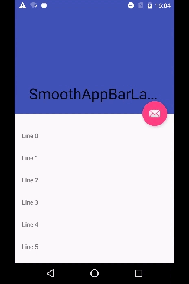
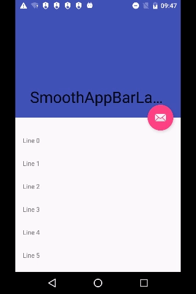

# CoordinatorLayout使用过程中遇到的问题

CoordinatorLayout 一般配合 NestedScrollView 或者 RecyclerView 使用
常常用于ScrollView滚动，ToolBar伸缩，渐变等背景视差效果等

CoordinatorLayout + AppBarLayout + CollapsingToolbarLayout 配合使用才会有比较完美的效果
app:layout_behavior属性，只有CoordinatorLayout的直接子布局才能响应。


- 无法联动CoordinatorLayout
  增加app:layout_behavior=”@string/appbar_scrolling_view_behavior”
  我这边用了一个自定义的FrameLayout结果在滚动的时候，AppBarLayout无法跟着联动，
  原因分析: 默认FrameLayout没有实现NestedScrollingChild接口，RecyclerView和NestedScrollView都实现了NestedScrollingChild接口，
  解决方法：ViewCompat.setNestedScrollingEnabled(frameLayout, true);
- 监听AppBarLayout 位置移动 AppBarLayout.addOnOffsetChangedListener(this);
  运行后发现 SystemBarUtils.transparencyAndDark() 改变状态栏背景的代码会导致 AppBarLayout 重绘，从而重新调用 onOffsetChanged() 方法，导致出现循环
  解决方法增加去重等，也可以增加当前状态栏标志位进行过滤。

```
@Override
public void onOffsetChanged(AppBarLayout appBarLayout, int verticalOffset)
{
    // 修改状态栏会触发 AppBarLayout重绘 onOffsetChanged() 方法，这里加个去重
    if (mCurVerticalOffset == verticalOffset)
        return;
    mCurVerticalOffset = verticalOffset;
    int offset = Math.abs(verticalOffset);
    int scrollRange = appBarLayout.getTotalScrollRange();
    if (offset <= scrollRange / 2)
    {
        mTitleOpenView.setVisibility(View.VISIBLE);
        mTitleCloseView.setVisibility(View.GONE);
    } else
    {
        SystemBarUtils.transparencyAndDark(TestActivity.this, true);
        mTitleOpenView.setVisibility(View.GONE);
        mTitleCloseView.setVisibility(View.VISIBLE);
    }
}
<?xml version="1.0" encoding="utf-8"?>
<android.support.design.widget.CoordinatorLayout xmlns:android="http://schemas.android.com/apk/res/android"
                                                 xmlns:app="http://schemas.android.com/apk/res-auto"
                                                 android:layout_width="match_parent"
                                                 android:layout_height="match_parent"
                                                 android:fitsSystemWindows="true">

    <in.srain.cube.views.ptr.PtrClassicFrameLayout
        android:id="@+id/ptr"
        android:layout_width="match_parent"
        android:layout_height="match_parent"
        app:layout_behavior="@string/appbar_scrolling_view_behavior"
        app:ptr_duration_to_close="300"
        app:ptr_duration_to_close_header="2000"
        app:ptr_keep_header_when_refresh="true"
        app:ptr_pull_to_fresh="false"
        app:ptr_ratio_of_header_height_to_refresh="1.2"
        app:ptr_resistance="1.7">

        <android.support.v7.widget.RecyclerView
            android:id="@+id/list"
            android:layout_width="match_parent"
            android:layout_height="match_parent"/>

    </in.srain.cube.views.ptr.PtrClassicFrameLayout>

    <android.support.design.widget.AppBarLayout
        android:id="@+id/app_bar"
        android:layout_width="match_parent"
        android:layout_height="@dimen/app_bar_height"
        android:fitsSystemWindows="true">

        <android.support.design.widget.CollapsingToolbarLayout
            android:id="@+id/toolbar_layout"
            android:layout_width="match_parent"
            android:layout_height="match_parent"
            android:fitsSystemWindows="true"
            app:layout_scrollFlags="scroll|exitUntilCollapsed">

            <android.support.v7.widget.Toolbar
                android:id="@+id/toolbar"
                android:layout_width="match_parent"
                android:layout_height="56dp"
                app:layout_collapseMode="pin"/>

        </android.support.design.widget.CollapsingToolbarLayout>
    </android.support.design.widget.AppBarLayout>
</android.support.design.widget.CoordinatorLayout>
```

注意：

1、AppBarLayout的直接子控件可以设置的属性:layout_scrollFlags

- scroll|exitUntilCollapsed如果AppBarLayout的直接子控件设置该属性,该子控件可以滚动,向上滚动NestedScrollView出父布局(一般为CoordinatorLayout)时,会折叠到顶端,向下滚动时NestedScrollView必须滚动到最上面的时候才能拉出该布局
- scroll|enterAlways:只要向下滚动该布局就会显示出来,只要向上滑动该布局就会向上收缩
- scroll|enterAlwaysCollapsed:向下滚动NestedScrollView到最底端时该布局才会显示出来
- 如果不设置改属性,则改布局不能滑动

2、CollapsingToolbarLayout,字面意思是折叠的toolbar,它确实是起到折叠作用的,可以把自己的自布局折叠 继承自framLayout,所以它的直接子类可以设置layout_gravity来控制显示的位置,它的直接子布局可以使用的属性:app:layout_collapseMode(折叠模式):可取的值如下:

- pin:在滑动过程中,此自布局会固定在它所在的位置不动,直到CollapsingToolbarLayout全部折叠或者全部展开
- parallax:视察效果,在滑动过程中,不管上滑还是下滑都会有视察效果,不知道什么事视察效果自己看gif图(layout_collapseParallaxMultiplier视差因子 0~1之间取值,当设置了parallax时可以配合这个属性使用,调节自己想要的视差效果)
- 不设置:跟随NestedScrollView的滑动一起滑动,NestedScrollView滑动多少距离他就会跟着走多少距离

3、在 support 25 及以下版本中，滑动并不流畅。在 RecyclerView 滑动到中间部分然后下拉的时候，顶部的 AppBarLayout 并不会跟随向下滑动详见视频。
在 26.1.0 以上的版本官方已经修改了。这里提供两个方法解决这个问题，但效果还不太理想。
第一种，自定义 AppBarLayout.Behavior ，监听 RecyclerView 的滚动事件，调用 onNestedFling 处理
在 layout android.support.design.widget.AppBarLayout 标签中使用
app:layout_behavior=”xx.xxx.Behavior”
第二种，直接代码监听 RecyclerView 的滚动事件，当一条数据完全展示时，将 AppBarLayout 设置为展开状态。

```java
RecyclerView.addOnScrollListener(new RecyclerView.OnScrollListener()
{
    @Override
    public void onScrollStateChanged(RecyclerView recyclerView, int newState)
    {
        super.onScrollStateChanged(recyclerView, newState);
        if (newState == RecyclerView.SCROLL_STATE_IDLE)
        {
            int firstVisiblePosition = manager.findFirstCompletelyVisibleItemPosition();
            if (firstVisiblePosition == 0)
            {
                appbar.setExpanded(true, true);
            }
        }
    }
});
```


4、其他方案
github 上有个库也是解决这个问题的 [smooth-app-bar-layout](https://github.com/henrytao-me/smooth-app-bar-layout)
当然解决的原理跟本文相差甚远，有兴趣可以阅读下，我自己也有用过，不过这个库比较蛋疼的就是得为RecyclerView 设置一个 head item， 这个 item 的高度必须跟 AppBarLayout 一样的高度，所以对于 wrap_content 就比较麻烦了，当然，这个跟这个库的实现思路有关系。

`com.android.support:appcompat-v7:25.3.0`


`com.android.support:appcompat-v7:26.0.0`


5、项目地址

https://github.com/android9527/CollapsingToobarLayoutDemo