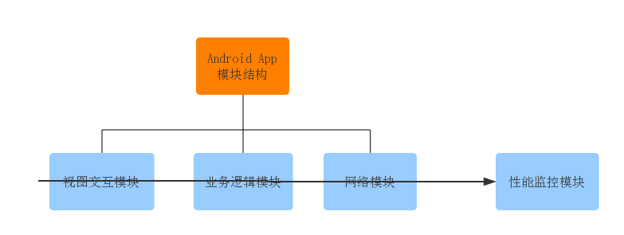
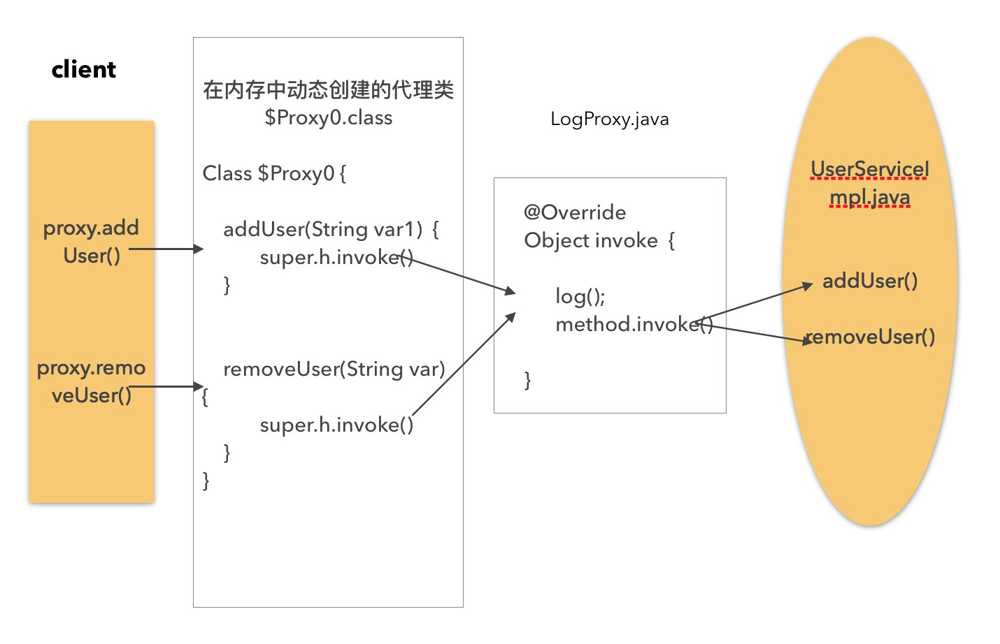
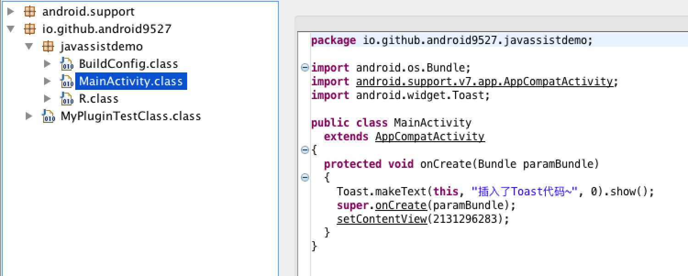
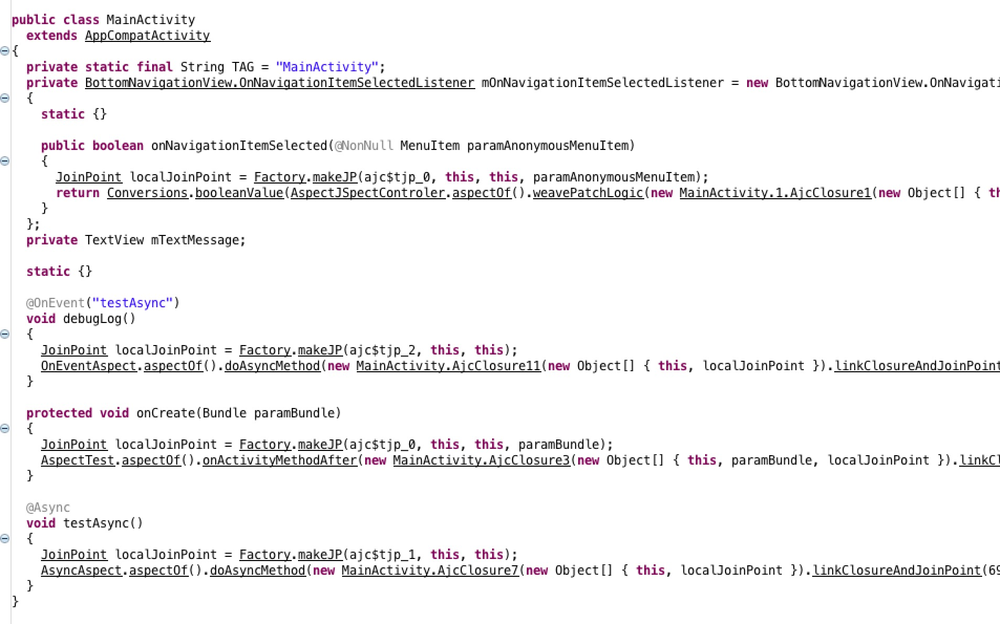

# AOP技术的几种实现方式

 发表于 2018-10-20 | 更新于: 2018-11-06 | 分类于 [Android](http://android9527.com/categories/Android/)

 字数统计: 5.1k | 阅读时长 ≈ 19 分钟

### 一、AOP概念

百度百科中对AOP的解释如下:
在软件业，AOP为Aspect Oriented Programming的缩写，意为：面向切面编程，通过预编译方式和运行期动态代理实现程序功能的统一维护的一种技术。AOP是OOP的延续，是软件开发中的一个热点，也是Spring框架中的一个重要内容，是函数式编程的一种衍生范型。 利用AOP可以对业务逻辑的各个部分进行隔离，从而使得业务逻辑各部分之间的耦合度降低，提高程序的可重用性，同时提高了开发的效率。

AOP只是一种思想的统称，实现这种思想的方法有挺多。AOP通过预编译方式和运行期动态代理实现程序功能的统一维护的一种技术。利用AOP可以对业务逻辑的各个部分进行隔离，从而使得业务逻辑各部分之间的耦合度降低，提高程序的可重用性，提高开发效率。

#### （1）AOP与OOP的关系

OOP（面向对象编程）针对业务处理过程的实体及其属性和行为进行抽象封装，以获得更加清晰高效的逻辑单元划分。但是也有它的缺点，最明显的就是关注点聚焦时，面向对象无法简单的解决这个问题，一个关注点是面向所有而不是单一的类，不受类的边界的约束，因此OOP无法将关注点聚焦来解决，只能分散到各个类中。
AOP（面向切面编程）则是针对业务处理过程中的切面进行提取，它所面对的是处理过程中的某个步骤或阶段，以获得逻辑过程中各部分之间低耦合性的隔离效果。这两种设计思想在目标上有着本质的差异。
AOP并不是与OOP对立的，而是为了弥补OOP的不足。OOP解决了竖向的问题，AOP则解决横向的问题。因为有了AOP我们的调试和监控就变得简单清晰。

简单的来讲，AOP是一种：可以在不改变原来代码的基础上，通过“动态注入”代码，来改变原来执行结果的技术。

#### （2）AOP主要应用场景

日志记录，性能统计，安全控制，事务处理，异常处理等等。

#### （3）主要目标

将日志记录，性能统计，安全控制，事务处理，异常处理等代码从业务逻辑代码中划分出来，通过对这些行为的分离，我们希望可以将它们独立到非指导业务逻辑的方法中，进而改变这些行为的时候不影响业务逻辑的代码。


上图是一个APP模块结构示例，按照照OOP的思想划分为“视图交互”，“业务逻辑”，“网络”等三个模块，而现在假设想要对所有模块的每个方法耗时（性能监控模块）进行统计。这个性能监控模块的功能就是需要横跨并嵌入众多模块里的，这就是典型的AOP的应用场景。

AOP的目标是把这些横跨并嵌入众多模块里的功能（如监控每个方法的性能） 集中起来，放到一个统一的地方来控制和管理。如果说，OOP如果是把问题划分到单个模块的话，那么AOP就是把涉及到众多模块的某一类问题进行统一管理。

对比：

| 功能     | OOP                            | AOP                              |
| :------- | :----------------------------- | :------------------------------- |
| 增加日志 | 所有功能模块单独添加，容易出错 | 能够将同一个关注点聚焦在一处解决 |
| 修改日志 | 功能代码分散，不方便调试       | 能够实现一处修改，处处生效       |

例如：在不改变 main 方法的同时通过代码注入的方式达到目的

```
/**
 * Before
 */
public class Test {
    public static void main(String[] args) {
        // do something
    }
}

/**
 * After
 */
public class Test {
    public static void main(String[] args) {
        long start = System.currentTimeMillis();
        // do something
        long end = System.currentTimeMillis() - start;
    }
}
```

### 二、AOP代码注入时机

代码注入主要利用了Java的反射和注解机制，根据注解时机的不同，主要分为运行时、加载时和编译时。

运行时：你的代码对增强代码的需求很明确，比如，必须使用动态代理（这可以说并不是真正的代码注入）。
加载时：当目标类被Dalvik或者ART加载的时候修改才会被执行。这是对Java字节码文件或者Android的dex文件进行的注入操作。
编译时：在打包发布程序之前，通过向编译过程添加额外的步骤来修改被编译的类。

### 三、AOP的几种实现方式

- Java 中的动态代理，运行时动态创建 Proxy 类实例
- APT，注解处理器，编译时生成 .java 代码
- Javassist for Android：一个移植到Android平台的非常知名的操纵字节码的java库，对 class 字节码进行修改
- AspectJ：和Java语言无缝衔接的面向切面的编程的扩展工具（可用于Android）。

#### 1、动态代理

##### 动态代理本质上还是java中的“代理设计模式”，不需要依赖其他类库，主要涉及到两个类

`InvocationHandler.java` InvocationHandler is the interface implemented by the invocation handler of a proxy instance.

`Proxy.java` Proxy provides static methods for creating dynamic proxy classes and instances, and it is also the superclass of all
dynamic proxy classes created by those methods.

##### 编码实现步骤

（1）创建目标接口UserService

```
public interface UserService
{
    @Log
    void addUser(String name);

    void remove(String name);
}
```

（2）创建具体实现类

```
public class UserServiceImpl implements UserService
{
    @Override
    public void addUser(String name)
    {
        System.out.println("addUser " + name);
    }

    @Override
    public void remove(String name) {
        System.out.println("remove " + name);
    }
}
```

（3）创建代理对象 implements InvocationHandler

```
@Override
public Object invoke(Object proxy, Method method, Object[] args)
        throws Throwable {

    if (method.isAnnotationPresent(Log.class)) {
        System.out.println("before method do something...");
        Object object = method.invoke(src, args);
        System.out.println("after method do something...");
        return object;
    } else {
        return method.invoke(src, args);
    }
}
```

（4）客户端调用

```
static void testProxy() {
    // 设置这个值，可以把生成的代理类，输出出来。
    System.getProperties().put("sun.misc.ProxyGenerator.saveGeneratedFiles", "true");
    UserService service = new UserServiceImpl();
    //生成被代理类的接口的子类
    UserService proxy = (UserService) Proxy.newProxyInstance(LogProxy.class.getClassLoader(), service.getClass().getInterfaces(),
                    new LogProxy(service));
    proxy.addUser("name1");
    proxy.remove("name2");
}
```

代理对象的生成实际上是在运行时利用反射获取构造函数，通过加载构造函数在内存中生成的，其中生成的对象持有调用处理器InvocationHandler，最后会调用h.invoke()方法


##### 想要实现特定方法写入日志，可以使用注解等方式。

```
/**
 * 自定义日志注解，用于判断该方法执行前是否需要写入日志
 */
@Retention(RetentionPolicy.RUNTIME)
@Target(value = ElementType.METHOD)
public @interface Log
{
}
```

#### 2、编译时注解APT实现

代表项目：ButterKnife, Dagger2, DataBinding

##### （1）APT的介绍

全名Annotation Processing Tool，注解处理器。对源代码文件进行检测找出其中的Annotation，使用 Annotation 进行额外的处理。
APT在处理 Annotation 时可以根据源文件中的 Annotation 生成额外的源文件和其它的文件(文件具体内容由Annotation处理器的编写者决定)，APT还会编译生成的源文件和原来的源文件，将它们一起生成class文件。
总结一句话，就是在编译时候，根据注解生成对应需要的文件，这样在app运行的时候就不会导致性能损耗。

##### （2）APT的处理要素

注解处理器（AbstractProcess）+ 代码处理（javaPoet）+ 注册处理器（AutoService）

##### （3）使用APT来处理 Annotation 的流程

1.定义注解（如@ViewBind）
2.定义注解处理器 继承 AbstractProcessor
3.在处理器里面完成处理方式，生成java代码。
4.注册 处理器 @AutoService(Processor.class)

```
/**
 * 要把处理器注册到javac中，需要打包一个特定的文件javax.annotation.processing.Processor到META-INF/services路径下
 * AutoService 会自动生成配置文件，注册处理器
 */
@AutoService(Processor.class)
public class ViewBindProcessor extends AbstractProcessor {

    /**
     * 处理器的初始化方法，可以获取相关的工具类
     */
    @Override
    public synchronized void init(ProcessingEnvironment processingEnv) {
        super.init(processingEnv);
    }

    /**
     * 处理器的主方法，用于扫描处理注解，生成java文件
     */
    @Override
    public boolean process(Set<? extends TypeElement> annotations, RoundEnvironment roundEnv) {
    }
}
```

#### 3、Javassist 实现

代表项目：Hotfix Instant Run

##### （1）原理

Javassist 可以直接操作字节码，从而实现代码注入，所以使用 Javassist 的时机就是在构建工具 Gradle 将源文件编译成 .class 文件之后，将 .class 打包成 dex 文件之前。

该方式需要借助Google提供的Transform API

先说一下Transform是什么
gradle从1.5开始，gradle 插件包含了一个叫Transform的API，这个API允许第三方插件在class文件转为为dex文件前操作编译好的class文件，
这个API的目标是简化自定义类操作，而不必处理Task，并且在操作上提供更大的灵活性。
官方文档：http://google.github.io/android-gradle-dsl/javadoc/

##### （2）开发步骤：

- 创建自定义 Gradle plugin module
  新建Android library module 留下src/main和build.gradle，其他的文件删除
- Gradle Transform API
  在main目录下创建 groovy 文件夹，然后在 groovy 目录下就可以创建我们的包名和 groovy 文件了,记得后缀要已 .groovy 结尾。在这个文件中引入创建的包名，然后写一个Class继承于Plugin< Project > 并重写apply方法
  创建 MyPlugin.groovy 文件
- 利用 javassist 或者 ASM 修改原有的class文件或者新增class

```
public class MyPlugin implements Plugin<Project> {

    void apply(Project project) {
        System.out.println("------------------开始----------------------");

        //AppExtension就是build.gradle中android{...}这一块
        def android = project.extensions.getByType(AppExtension)

        //注册一个Transform
        def classTransform = new MyClassTransform(project)
        android.registerTransform(classTransform)

        System.out.println("------------------结束----------------------");
    }
}

public class MyTransform extends Transform {

    @Override
    void transform(Context context, Collection<TransformInput> inputs, Collection<TransformInput> referencedInputs, TransformOutputProvider outputProvider, boolean isIncremental) throws IOException, TransformException, InterruptedException {
        super.transform(context, inputs, referencedInputs, outputProvider, isIncremental)

        // javassist 操作字节码
        // 获取MainActivity.class
        CtClass ctClass = pool.getCtClass("io.github.android9527.javassistdemo.MainActivity");
        if (ctClass.isFrozen())
            ctClass.defrost()
        // 获取到OnCreate方法
        CtMethod ctMethod = ctClass.getDeclaredMethod("onCreate")
        String insetBeforeStr = """ android.widget.Toast.makeText(this, "插入了Toast代码~", android.widget.Toast.LENGTH_SHORT).show();
                                                        """
        //在方法开头插入代码
        ctMethod.insertBefore(insetBeforeStr)
        ctClass.writeFile(path)
        ctClass.detach() //释放
    }
}
```

- 配置plugin 在main目录下创建resources文件夹，继续在resources下创建META-INF文件夹，
  继续在META-INF文件夹下创建`gradle-plugins`文件夹，最后在gradle-plugins文件夹下创建一个xxx.properties文件，
  注意：这个xxx就是在app下的build.gradle中引入时的名字，例如：apply plugin: ‘xxx’。
  在文件中写 `implementation-class=io.github.android9527.MyPlugin`。
- 需改build.gradle 内容，然后执行 uploadArchives 这个task 上传到 maven 库，就将我们的这个插件打包上传到了本地 maven 中，可以去本地的 maven 库中查看

```
apply plugin: 'groovy'
apply plugin: 'maven'

dependencies {
    // gradle sdk
    compile gradleApi()
    // groovy sdk
    compile localGroovy()
    // 可以引用其它库
    compile fileTree(dir: 'libs', include: ['*.jar'])

    compile 'com.android.tools.build:transform-api:1.5.0'
    compile 'javassist:javassist:3.12.1.GA'
    compile 'com.android.tools.build:gradle:3.1.2'
}

uploadArchives{
    repositories{
        mavenDeployer{
            repository(url:uri('../repo'))
            pom.groupId = 'com.android9527.plugin' // 组名
            pom.artifactId = 'test' // 插件名
            pom.version = '1.0.1-SNAPSHOT' // 版本号
        }
    }
}
group='com.android9527.plugin'
version='1.0-SNAPSHOT'
```

- 项目主 module 依赖该 plugin 运行项目，反编译之后查看字节码


#### 4、Android中使用 AspectJ

代表项目：Hugo(打印每个方法的执行时间) sa-sdk-android（全埋点技术）

##### （1）原理

AspectJ 意思就是Java的Aspect，Java的AOP。它的核心是ajc（编译器 aspectjtools）和 weaver（织入器 aspectjweaver）。

ajc编译器：基于Java编译器之上的，它是用来编译.aj文件，aspectj在Java编译器的基础上增加了一些它自己的关键字和方法。因此，ajc也可以编译Java代码。

weaver织入器：为了在java编译器上使用AspectJ而不依赖于Ajc编译器，aspectJ 5出现了 @AspectJ，使用注释的方式编写AspectJ代码，可以在任何Java编译器上使用。
由于AndroidStudio默认是没有ajc编译器的，所以在Android中使用@AspectJ来编写。它在代码的编译期间扫描目标程序，根据切点（PointCut）匹配,将开发者编写的Aspect程序编织（Weave）到目标程序的.class文件中，对目标程序作了重构（重构单位是JoinPoint），目的就是建立目标程序与Aspect程序的连接（获得执行的对象、方法、参数等上下文信息），从而达到AOP的目的。

##### （2）AspectJ 术语

切面（Aspect）：一个关注点的模块化，这个关注点实现可能另外横切多个对象。其实就是共有功能的实现。如日志切面、权限切面、事务切面等。
通知（Advice）：是切面的具体实现。以目标方法为参照点，根据放置的地方不同，可分为前置通知（Before）、后置通知（AfterReturning）、异常通知（AfterThrowing）、最终通知（After）与环绕通知（Around）5种。在实际应用中通常是切面类中的一个方法，具体属于哪类通知由配置指定的。
切入点（Pointcut）：用于定义通知应该切入到哪些连接点上。不同的通知通常需要切入到不同的连接点上，这种精准的匹配是由切入点的正则表达式来定义的。
连接点（JoinPoint）：就是程序在运行过程中能够插入切面的地点。例如，方法调用、异常抛出或字段修改等。
目标对象（Target Object）：包含连接点的对象，也被称作被通知或被代理对象。这些对象中已经只剩下干干净净的核心业务逻辑代码了，所有的共有功能等代码则是等待AOP容器的切入。
AOP代理（AOP Proxy）：将通知应用到目标对象之后被动态创建的对象。可以简单地理解为，代理对象的功能等于目标对象的核心业务逻辑功能加上共有功能。代理对象对于使用者而言是透明的，是程序运行过程中的产物。
编织（Weaving）：将切面应用到目标对象从而创建一个新的代理对象的过程。这个过程可以发生在编译期、类装载期及运行期，当然不同的发生点有着不同的前提条件。譬如发生在编译期的话，就要求有一个支持这种AOP实现的特殊编译器（如AspectJ编译器）；发生在类装载期，就要求有一个支持AOP实现的特殊类装载器；只有发生在运行期，则可直接通过Java语言的反射机制与动态代理机制来动态实现（如Spring）。
引入（Introduction）：添加方法或字段到被通知的类。

##### （3）在Android项目中使用AspectJ

- gradle配置的方式：引入AspectJ是有点复杂的，需要引入大量的gradle命令配置有点麻烦，在build文件中添加了一些脚本，文章出处：https://fernandocejas.com/2014/08/03/aspect-oriented-programming-in-android/
- 使用 gradle 插件（也是对 gradle 命令进行了包装）：Jake Wharton 大神的 hugo 项目（一款日志打印的插件）

上海沪江团队的 gradle_plugin_android_aspectjx 一个基于AspectJ并在此基础上扩展出来可应用于Android开发平台的AOP框架，可作用于java源码，class文件及jar包，同时支持kotlin的应用。

AOP的用处非常广，从spring到Android，各个地方都有使用，特别是在后端，Spring中已经使用的非常方便了，而且功能非常强大，但是在Android中，AspectJ的实现是略阉割的版本，并不是所有功能都支持，但对于一般的客户端开发来说，已经完全足够用了。

##### （4）以 AspectJX 接入说明

- 首先，需要在项目根目录的build.gradle中增加依赖：

```
buildscript {
    repositories {
        jcenter()
    }
    dependencies {
        classpath 'com.android.tools.build:gradle:2.3.3'
        classpath 'com.hujiang.aspectjx:gradle-android-plugin-aspectjx:2.0.4'
    }
}
```

- 然后module项目的 build.gradle 中加入 AspectJ 的依赖：

```
apply plugin: 'android-aspectjx'
dependencies {
        compile 'org.aspectj:aspectjrt:1.8.+'
    }

aspectjx {
    //排除所有package路径中包含`android.support`的class文件及库（jar文件）
    exclude 'org.apache.httpcomponents'
    exclude 'android.support'
}
```

- 具体配置参见github地址 https://github.com/HujiangTechnology/gradle_plugin_android_aspectjx
- 我们通过一段简单的代码来了解下基本的使用方法和功能，新建一个AspectTest类文件，代码如下：

```
@Aspect
public class AspectTest {

    private static final String TAG = "xuyisheng";

    @Before("execution(* android.app.Activity.on**(..))")
    public void onActivityMethodBefore(JoinPoint joinPoint) throws Throwable {
        String key = joinPoint.getSignature().toString();
        Log.e(TAG, "onActivityMethodBefore: " + key);
    }

    @After("execution(* android.app.Activity.on**(..))")
    public void onActivityMethodAfter(JoinPoint joinPoint) throws Throwable {
        String key = joinPoint.getSignature().toString();
        Log.e(TAG, "onActivityMethodAfter: " + key);
    }

    @Around("execution(* android.app.Activity.on**(..))")
    public void onActivityMethodAfter(ProceedingJoinPoint joinPoint) throws Throwable {
        String key = joinPoint.getSignature().toString();
        Log.e(TAG, "onActivityMethodBefore: " + key);
        joinPoint.proceed();
        Log.e(TAG, "onActivityMethodAfter: " + key);
    }
}
```

在类的最开始，我们使用 @Aspect 注解来定义这样一个AspectJ文件，编译器在编译的时候，就会自动去解析，并不需要主动去调用AspectJ类里面的代码。

##### （5）编织速度优化建议

- 尽量使用精确的匹配规则,降低匹配时间。
- 排除不需要扫描的包。

通过这种方式编译后，我们来看下生成的代码是怎样的。AspectJ的原理实际上是在编译的时候，根据一定的规则解析，然后插入一些代码，通过aspectj生成的代码，会在Build目录下：


我们可以发现，在onCreate的最前面，插入了一行AspectJ的代码。这个就是AspectJ的主要功能，抛开AOP的思想来说，我们想做的，实际上就是『在不侵入原有代码的基础上，增加新的代码』。

### 四、总结：

动态代理
优点：

- Java API 提供的，兼容性好，无需依赖其他库，
- 动态代理类的字节码在程序运行时由Java反射机制动态生成，无需程序员手工编写它的源代码。
- 动态代理类不仅简化了编程工作，而且提高了软件系统的可扩展性，因为Java 反射机制可以生成任意类型的动态代理类。

缺点：

- 只能代理实现了接口的类，而不能实现接口的类就不能实现JDK的动态代理，cglib是针对类来实现代理的，他的原理是对指定的目标类生成一个子类，并覆盖其中方法实现增强，但因为采用的是继承，所以不能对final修饰的类进行代理。
- 没有代码注入步骤，必须手动实例化并应用，
- 功能有限，只能在方法前后执行一些代码

APT
优点：

- 任何你不想做的繁杂的工作，它可以帮你减少样板代码
- 生成代码位置的可控性（可以在任意包位置生成代码），与原有代码的关联性更为紧密方便

缺点：

- 只有被注解标记了的类或方法等，才可以被处理或收集信息。
- APT可以自动生成代码，但在运行时却需要主动调用

Javassist ：

- 功能强大，使用方便，
- 由于Javassist可以直接操作修改编译后的字节码，直接绕过了java编译器，所以可以做很多突破限制的事情，例如，跨dex引用，解决热修复中CLASS_ISPREVERIFIED的问题。
- 运行时生成，减少不必要的生成开销；通过将切面逻辑写入字节码，减少了生成子类的开销，不会产生过多子类。运行时加入切面逻辑，产生性能开销。

Aspectj：

- AspectJ除了hook之外，AspectJ还可以为目标类添加变量，接口。另外，AspectJ也有抽象，继承等各种更高级的玩法。它能够在编译期间直接修改源代码生成class。
- AspectJ语法比较多，但是掌握几个简单常用的，就能实现绝大多数切片，完全兼容Java（纯Java语言开发，然后使用AspectJ注解，简称@AspectJ。）

### 五、参考资料：

[AOP之@AspectJ技术原理详解](https://blog.csdn.net/woshimalingyi/article/details/73252013)

[安卓 AOP 三剑客: APT,AspectJ,Javassist](https://juejin.im/entry/581aec732e958a0054d08213)

[Android动态编译技术 Plugin Transform Javassist操作Class文件](https://www.jianshu.com/p/a6be7cdcfc65)

[深入理解Android之AOP](https://blog.csdn.net/innost/article/details/49387395)

[归纳AOP在Android开发中的几种常见用法](http://www.jianshu.com/p/2779e3bb1f14)

[看AspectJ在Android中的强势插入](http://blog.csdn.net/eclipsexys/article/details/54425414)