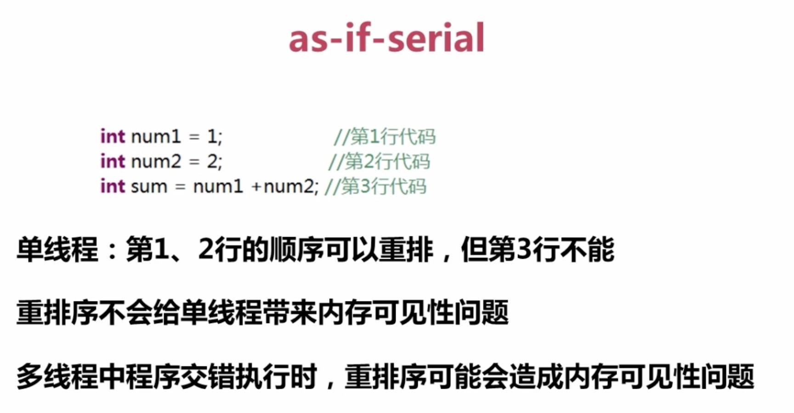

# volatile 内存可见性和指令重排

## Java 中内存可见性

内存可见性：一个线程对共享变量值的修改，能够及时地被其他线程看到
共享变量：如果一个变量在多个线程的工作内存中都存在副本，那么这个变量就是这几个线程的共享变量
<!-- more -->
Java内存模型JMM两条规定：

- 线程对共享变量的所有操作都必须在自己的工作内存中进行，不能直接从主内存中读写
- 不同线程之间无法直接访问其他线程工作内存中的变量，线程间变量值的传递需要通过主内存来完成

可见性：

JMM关于 synchronized 的两条规定：

- 线程解锁钱，必须把共享变量的最新值刷新到主内存中

- 线程加锁时，将清空工作内存中共享变量的值，从而使用共享变量时需要从内存中重新读取最新的值

  

  重排序：代码书写的顺序与实际执行的顺序不同，指令重排序是编译器或处理器为了提高兴许性能而做得优化

- 1、编译器优化的重排序（编译器优化）

- 2、指令级并行重排序（处理器优化）

- 3、内存系统的重排序（处理器优化）
  as-if-serial：无论如何重排序，程序执行的结果应该与代码顺序执行的结果一致（Java编译器、运行时和处理器都会保证Java在单线程下遵循as-if-serial语义）


#### volatile两大作用

- 1、保证内存可见性
- 2、防止指令重排

此外需注意 `volatile` 并不保证操作的原子性。

#####（一）内存可见性

- 1、概念

JVM内存模型：主内存和线程独立的工作内存

Java内存模型规定，对于多个线程共享的变量，存储在主内存当中，每个线程都有自己独立的工作内存（比如CPU的寄存器），线程只能访问自己的工作内存，不可以访问其它线程的工作内存。

工作内存中保存了主内存共享变量的副本，线程要操作这些共享变量，只能通过操作工作内存中的副本来实现，操作完毕之后再同步回到主内存当中。

如何保证多个线程操作主内存的数据完整性是一个难题，Java内存模型也规定了工作内存与主内存之间交互的协议，定义了8种原子操作：

(1) lock:将主内存中的变量锁定，为一个线程所独占

(2) unclock:将lock加的锁定解除，此时其它的线程可以有机会访问此变量

(3) read:将主内存中的变量值读到工作内存当中

(4) load:将read读取的值保存到工作内存中的变量副本中。

(5) use:将值传递给线程的代码执行引擎

(6) assign:将执行引擎处理返回的值重新赋值给变量副本

(7) store:将变量副本的值存储到主内存中。

(8) write:将store存储的值写入到主内存的共享变量当中。

通过上面Java内存模型的概述，我们会注意到这么一个问题，每个线程在获取锁之后会在自己的工作内存来操作共享变量，操作完成之后将工作内存中的副本回写到主内存，并且在其它线程从主内存将变量同步回自己的工作内存之前，共享变量的改变对其是不可见的。即其他线程的本地内存中的变量已经是过时的，并不是更新后的值。

- 2 内存可见性带来的问题
  很多时候我们需要一个线程对共享变量的改动，其它线程也需要立即得知这个改动该怎么办呢？下面举两个例子说明内存可见性的重要性：

例子1

有一个全局的状态变量open:

```
boolean open=true;

这个变量用来描述对一个资源的打开关闭状态，true表示打开，false表示关闭，假设有一个线程A,在执行一些操作后将open修改为false:

//线程A

resource.close();

open = false;

线程B随时关注open的状态，当open为true的时候通过访问资源来进行一些操作:

//线程B

while(open) {
    doSomethingWithResource(resource);
}
```

当A把资源关闭的时候，open变量对线程B是不可见的，如果此时open变量的改动尚未同步到线程B的工作内存中,那么线程B就会用一个已经关闭了的资源去做一些操作，因此产生错误。

- 3 提供内存可见性
  volatile保证可见性的原理是在每次访问变量时都会进行一次刷新，因此每次访问都是主内存中最新的版本。所以volatile关键字的作用之一就是保证变量修改的实时可见性。

针对上面的例子：

要求一个线程对open的改变，其他的线程能够立即可见，Java为此提供了volatile关键字，在声明open变量的时候加入volatile关键字就可以保证open的内存可见性，即open的改变对所有的线程都是立即可见的。

备注：也可以通过提供synchronized同步的open变量的Get/Set方法解决此内存可见性

####（二）指令重排

- 1 概念

指令重排序是JVM为了优化指令，提高程序运行效率，在不影响单线程程序执行结果的前提下，尽可能地提高并行度。编译器、处理器也遵循这样一个目标。注意是单线程。多线程的情况下指令重排序就会给程序员带来问题。

不同的指令间可能存在数据依赖。比如下面计算圆的面积的语句：

double r = 2.3d;//(1)

double pi =3.1415926; //(2)

double area = pi *r* r; //(3)

area的计算依赖于r与pi两个变量的赋值指令。而r与pi无依赖关系。

as-if-serial语义是指：不管如何重排序（编译器与处理器为了提高并行度），（单线程）程序的结果不能被改变。这是编译器、Runtime、处理器必须遵守的语义。

虽然，（1） - happensbefore -> （2）,（2） - happens before -> （3），但是计算顺序(1)(2)(3)与(2)(1)(3) 对于r、pi、area变量的结果并无区别。编译器、Runtime在优化时可以根据情况重排序（1）与（2），而丝毫不影响程序的结果。

指令重排序包括编译器重排序和运行时重排序。

- 2 指令重排带来的问题

如果一个操作不是原子的，就会给JVM留下重排的机会。下面看几个例子：

例子1：A线程指令重排导致B线程出错
对于在同一个线程内，这样的改变是不会对逻辑产生影响的，但是在多线程的情况下指令重排序会带来问题。看下面这个情景:

在线程A中:

```
context = loadContext();

inited = true;
```

在线程B中:

```
while(!inited ){ //根据线程A中对inited变量的修改决定是否使用context变量
   sleep(100);
}

doSomethingwithconfig(context);
```

假设线程A中发生了指令重排序:

```
inited = true;

context = loadContext();
```

那么B中很可能就会拿到一个尚未初始化或尚未初始化完成的context,从而引发程序错误。

例子2：指令重排导致单例模式失效

我们都知道一个经典的懒加载方式的双重判断单例模式：

```
public class Singleton {
    private static Singleton instance = null;
    private Singleton() {
    }

    public static Singleton getInstance() {
        if (instance == null) {
            synchronized (Singleton.class) {
                if (instance == null) {
                    //非原子操作
                    instance = new Singleton();
                }
            }
        }
        return instance;
    }
}
```

看似简单的一段赋值语句：`instance= new Singleton()`，但是很不幸它并不是一个原子操作，其实际上可以抽象为下面几条JVM指令：

```
memory =allocate();    //1：分配对象的内存空间 

ctorInstance(memory);  //2：初始化对象 

instance =memory;     //3：设置instance指向刚分配的内存地址
```

上面操作2 依赖于操作1，但是操作3 并不依赖于操作2，所以JVM是可以针对它们进行指令的优化重排序的，经过重排序后如下：

```
memory =allocate();    //1：分配对象的内存空间 

instance =memory;     //3：instance指向刚分配的内存地址，此时对象还未初始化

ctorInstance(memory);  //2：初始化对象
```

可以看到指令重排之后，instance 指向分配好的内存放在了前面，而这段内存的初始化被排在了后面。

在线程A执行这段赋值语句，在初始化分配对象之前就已经将其赋值给 instance 引用，恰好另一个线程进入方法判断 instance 引用不为 null，然后就将其返回使用，导致出错。

- 3 防止指令重排

除了前面内存可见性中讲到的 volatile 关键字可以保证变量修改的可见性之外，还有另一个重要的作用：在JDK1.5之后，可以使用 volatile 变量禁止指令重排序。

解决方案：例子1中的inited和例子2中的 instance 以关键字 volatile 修饰之后，就会阻止JVM对其相关代码进行指令重排，这样就能够按照既定的顺序指执行。

volatile 关键字通过提供“内存屏障”的方式来防止指令被重排序，为了实现 volatile 的内存语义，编译器在生成字节码时，会在指令序列中插入内存屏障来禁止特定类型的处理器重排序。

大多数的处理器都支持内存屏障的指令。

对于编译器来说，发现一个最优布置来最小化插入屏障的总数几乎不可能，为此，Java内存模型采取保守策略。下面是基于保守策略的JMM内存屏障插入策略：

在每个volatile写操作的前面插入一个StoreStore屏障。

在每个volatile写操作的后面插入一个StoreLoad屏障。

在每个volatile读操作的后面插入一个LoadLoad屏障。

在每个volatile读操作的后面插入一个LoadStore屏障。

####（三）总结
volatile是轻量级同步机制
相对于synchronized块的代码锁，volatile 应该是提供了一个轻量级的针对共享变量的锁，当我们在多个线程间使用共享变量进行通信的时候需要考虑将共享变量用volatile来修饰。

volatile是一种稍弱的同步机制，在访问 volatile 变量时不会执行加锁操作，也就不会执行线程阻塞，因此volatilei变量是一种比synchronized关键字更轻量级的同步机制。

volatile使用建议
使用建议：在两个或者更多的线程需要访问的成员变量上使用volatile。当要访问的变量已在synchronized代码块中，或者为常量时，没必要使用volatile。

由于使用volatile屏蔽掉了JVM中必要的代码优化，所以在效率上比较低，因此一定在必要时才使用此关键字。

#### volatile和synchronized区别

- 1、volatile不会进行加锁操作：

volatile变量是一种稍弱的同步机制在访问volatile变量时不会执行加锁操作，因此也就不会使执行线程阻塞，因此volatile变量是一种比synchronized关键字更轻量级的同步机制。

- 2、volatile变量作用类似于同步变量读写操作：

从内存可见性的角度看，写入volatile变量相当于退出同步代码块，而读取volatile变量相当于进入同步代码块。

- 3、volatile不如synchronized安全：

在代码中如果过度依赖volatile变量来控制状态的可见性，通常会比使用锁的代码更脆弱，也更难以理解。仅当volatile变量能简化代码的实现以及对同步策略的验证时，才应该使用它。一般来说，用同步机制会更安全些。

- 4、volatile无法同时保证内存可见性和原子性：

加锁机制（即同步机制）既可以确保可见性又可以确保原子性，而volatile变量只能确保可见性，原因是声明为volatile的简单变量如果当前值与该变量以前的值相关，那么volatile关键字不起作用，也就是说如下的表达式都不是原子操作：“count++”、“count = count+1”。

当且仅当满足以下所有条件时，才应该使用volatile变量：

- 1、 对变量的写入操作不依赖变量的当前值，或者你能确保只有单个线程更新变量的值。
- 2、该变量没有包含在具有其他变量的不变式中。

总结：在需要同步的时候，第一选择应该是synchronized关键字，这是最安全的方式，尝试其他任何方式都是有风险的。尤其在、jdK1.5之后，对synchronized同步机制做了很多优化，如：自适应的自旋锁、锁粗化、锁消除、轻量级锁等，使得它的性能明显有了很大的提升。

#### volatile和synchronized特点

首先需要理解线程安全的两个方面：执行控制和内存可见。

- 执行控制的目的是控制代码执行（顺序）及是否可以并发执行。
- 内存可见控制的是线程执行结果在内存中对其它线程的可见性。根据Java内存模型的实现，线程在具体执行时，会先拷贝主存数据到线程本地（CPU缓存），操作完成后再把结果从线程本地刷到主存。

synchronized 关键字解决的是执行控制的问题，它会阻止其它线程获取当前对象的监控锁，这样就使得当前对象中被 synchronized 关键字保护的代码块无法被其它线程访问，也就无法并发执行。更重要的是，synchronized 还会创建一个内存屏障，内存屏障指令保证了所有CPU操作结果都会直接刷到主存中，从而保证了操作的内存可见性，同时也使得先获得这个锁的线程的所有操作，都 happens-before 于随后获得这个锁的线程的操作。

volatile 关键字解决的是内存可见性的问题，会使得所有对 volatile 变量的读写都会直接刷到主存，即保证了变量的可见性。这样就能满足一些对变量可见性有要求而对读取顺序没有要求的需求。

使用 volatile 关键字仅能实现对原始变量(如boolen、 short 、int 、long等)操作的原子性，但需要特别注意， volatile 不能保证复合操作的原子性，即使只是i++，实际上也是由多个原子操作组成：read i; inc; write i，假如多个线程同时执行i++，volatile 只能保证他们操作的i是同一块内存，但依然可能出现写入脏数据的情况。

在Java 5提供了原子数据类型atomic wrapper classes，对它们的increase之类的操作都是原子操作，不需要使用sychronized关键字。

对于volatile关键字，当且仅当满足以下所有条件时可使用：

1. 对变量的写入操作不依赖变量的当前值，或者你能确保只有单个线程更新变量的值。
2. 该变量没有包含在具有其他变量的不变式中。

#### volatile 和 synchronized 的区别

- volatile 本质是在告诉jvm当前变量在寄存器（工作内存）中的值是不确定的，需要从主存中读取；synchronized 则是锁定当前变量，只有当前线程可以访问该变量，其他线程被阻塞住。
- 作用域不同 volatile 仅能使用在变量级别；synchronized 则可以使用在变量、方法、和类级别的
- volatile 仅能实现变量的修改可见性，不能保证原子性；而 synchronized 则可以保证变量的修改可见性和原子性
- volatile 不会造成线程的阻塞；synchronized 可能会造成线程的阻塞。volatile 标记的变量不会被编译器优化；synchronized 标记的变量可以被编译器优化