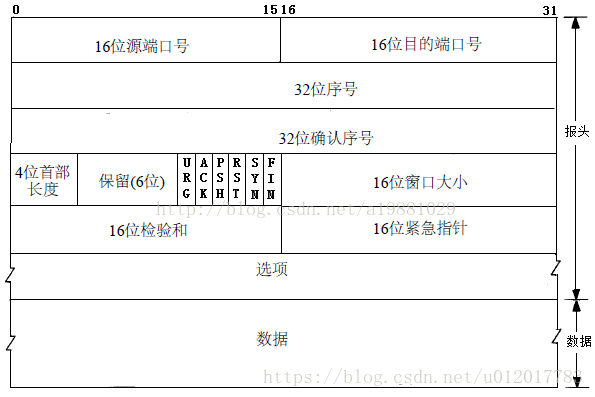
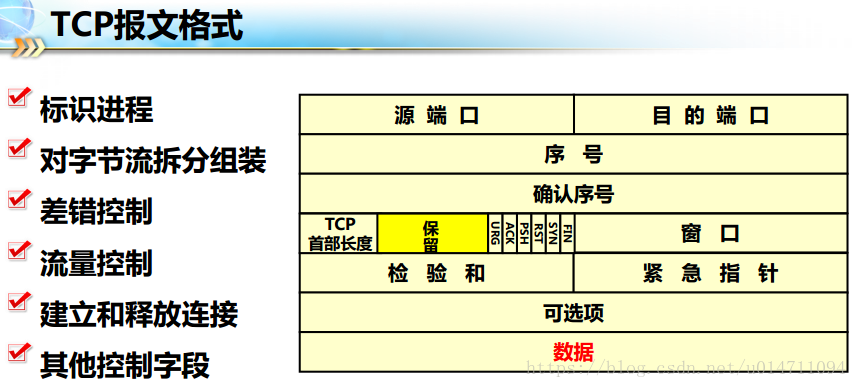
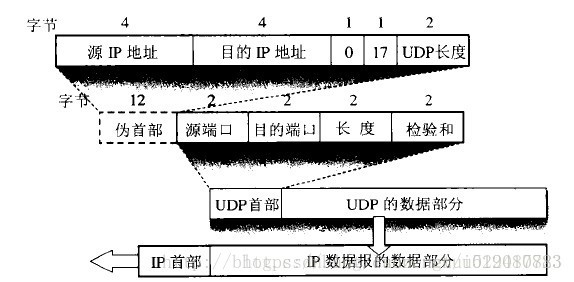
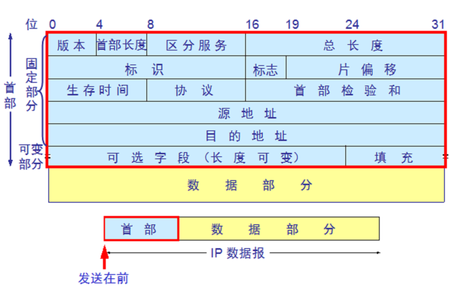

# TCP 和 UDP 报文协议

#### TCP 报文格式

<!-- more -->

TCP报文是TCP层传输的数据单元，也叫报文段

**1、端口号**：各16 bits。用来标识同一台计算机的不同的应用进程。

**1）源端口**：源端口和IP地址的作用是标识报文的返回地址。

**2）目的端口**：端口指明接收方计算机上的应用程序接口。

TCP报头中的源端口号和目的端口号同IP数据报中的源IP与目的IP唯一确定一条TCP连接。

**2、序号和确认号**：各32 bits。是TCP可靠传输的关键部分。序号是本报文段发送的数据组的第一个字节的序号。在TCP传送的流中，每一个字节一个序号。e.g.一个报文段的序号为300，此报文段数据部分共有100字节，则下一个报文段的序号为400。所以序号确保了TCP传输的有序性。确认号，即ACK，指明下一个期待收到的字节序号，表明该序号之前的所有数据已经正确无误的收到。确认号只有当ACK标志为1时才有效。比如建立连接时，SYN报文的ACK标志位为0。

**3、数据偏移／首部长度**：4 bits。由于首部可能含有可选项内容，因此TCP报头的长度是不确定的，报头不包含任何任选字段则长度为20字节，4位首部长度字段所能表示的最大值为1111，转化为10进制为15，15*32/8 = 60，故报头最大长度为60字节。首部长度也叫数据偏移，是因为首部长度实际上指示了数据区在报文段中的起始偏移值。

**4、保留**：6 bits。为将来定义新的用途保留，现在一般置0。

**5、控制位**：URG ACK PSH RST SYN FIN，共6个，每一个标志位表示一个控制功能。

**1）URG**：紧急指针标志，为1时表示紧急指针有效，为0则忽略紧急指针。

**2）ACK**：确认序号标志，为1时表示确认号有效，为0表示报文中不含确认信息，忽略确认号字段。

**3）PSH**：push标志，为1表示是带有push标志的数据，指示接收方在接收到该报文段以后，应尽快将这个报文段交给应用程序，而不是在缓冲区排队。

**4）RST**：重置连接标志，用于重置由于主机崩溃或其他原因而出现错误的连接。或者用于拒绝非法的报文段和拒绝连接请求。

**5）SYN**：同步序号，用于建立连接过程，在连接请求中，SYN=1和ACK=0表示该数据段没有使用捎带的确认域，而连接应答捎带一个确认，即SYN=1和ACK=1。

**6）FIN**：finish标志，用于释放连接，为1时表示发送方已经没有数据发送了，即关闭本方数据流。

**6、窗口**：滑动窗口大小，用来告知发送端接受端的缓存大小，以此控制发送端发送数据的速率，从而达到流量控制。窗口大小时一个16bit字段，因而窗口大小最大为65535。

**7、校验和**：奇偶校验，此校验和是对整个的 TCP 报文段，包括 TCP 头部和 TCP 数据，以 16 位字进行计算所得。由发送端计算和存储，并由接收端进行验证。

**8、紧急指针**：只有当 URG 标志置 1 时紧急指针才有效。紧急指针是一个正的偏移量，和顺序号字段中的值相加表示紧急数据最后一个字节的序号。 TCP 的紧急方式是发送端向另一端发送紧急数据的一种方式。

**9、选项和填充**：最常见的可选字段是最长报文大小，又称为MSS（Maximum Segment Size），每个连接方通常都在通信的第一个报文段（为建立连接而设置SYN标志为1的那个段）中指明这个选项，它表示本端所能接受的最大报文段的长度。选项长度不一定是32位的整数倍，所以要加填充位，即在这个字段中加入额外的零，以保证TCP头是32的整数倍。

**10、数据部分**： TCP 报文段中的数据部分是可选的。在一个连接建立和一个连接终止时，双方交换的报文段仅有 TCP 首部。如果一方没有数据要发送，也使用没有任何数据的首部来确认收到的数据。在处理超时的许多情况中，也会发送不带任何数据的报文段。

#### UDP 报文格式

1、UDP 有两个字段：数据字段和首部字段。

首部字段
首部字段很简单，只有8个字节，由4个字段组成，每个字段的长度都是两个字节。

1）源端口：源端口号。在需要对方回信时选用。不需要时可用全0。
2）目的端口：目的端口号。这在终点交付报文时必须要使用到。
3）长度： UDP用户数据报的长度，其最小值是8（仅有首部）。
4）校验和：检测UDP用户数据报在传输中是否有错。有错就丢弃。

2、要注意的地方

UDP首部中校验和的计算方法有些特殊。在计算校验和时，要在UDP用户数据报之前增加12个字节的伪首部。

伪首部并非TCP&UDP数据报中实际的有效成分。伪首部是一个虚拟的数据结构，其中的信息是从数据报所在IP分组头的分组头中提取的，既不向下传送也不向上递交，而仅仅是为计算校验和。
与IP数据报的校验和只校验IP数据报的首部不同，UDP的校验和是把首部和数据部分一起都校验。

伪首部：
伪首部(pseudo header)，通常有TCP伪首部和UDP伪首部。在UDP/TCP伪首部中，包含32位源IP地址，32位目的IP地址，8位填充0，8位协议，16位TCP/UDP长度。通过伪首部的校验，UDP可以确定该数据报是不是发给本机的，通过首部协议字段，UDP可以确认有没有误传。

#### IP 报文格式

版本：IP协议的版本，目前的IP协议版本号为4，下一代IP协议版本号为6。

首部长度：IP报头的长度。固定部分的长度（20字节）和可变部分的长度之和。共占4位。最大为1111，即10进制的15，代表IP报头的最大长度可以为15个32bits（4字节），也就是最长可为15*4=60字节，除去固定部分的长度20字节，可变部分的长度最大为40字节。

服务类型：Type Of Service。

总长度：IP报文的总长度。报头的长度和数据部分的长度之和。

标识：唯一的标识主机发送的每一分数据报。通常每发送一个报文，它的值加一。当IP报文长度超过传输网络的MTU（最大传输单元）时必须分片，这个标识字段的值被复制到所有数据分片的标识字段中，使得这些分片在达到最终目的地时可以依照标识字段的内容重新组成原先的数据。

标志：共3位。R、DF、MF三位。目前只有后两位有效，DF位：为1表示不分片，为0表示分片。MF：为1表示“更多的片”，为0表示这是最后一片。

片位移：本分片在原先数据报文中相对首位的偏移位。（需要再乘以8）

生存时间：IP报文所允许通过的路由器的最大数量。每经过一个路由器，TTL减1，当为0时，路由器将该数据报丢弃。TTL 字段是由发送端初始设置一个 8 bit字段.推荐的初始值由分配数字 RFC 指定，当前值为 64。发送 ICMP 回显应答时经常把 TTL 设为最大值 255。

协议：指出IP报文携带的数据使用的是那种协议，以便目的主机的IP层能知道要将数据报上交到哪个进程（不同的协议有专门不同的进程处理）。和端口号类似，此处采用协议号，TCP的协议号为6，UDP的协议号为17。ICMP的协议号为1，IGMP的协议号为2.

首部校验和：计算IP头部的校验和，检查IP报头的完整性。

源IP地址：标识IP数据报的源端设备。

目的IP地址：标识IP数据报的目的地址。

#### 参考

[IP报文格式详解](https://blog.csdn.net/mary19920410/article/details/59035804)