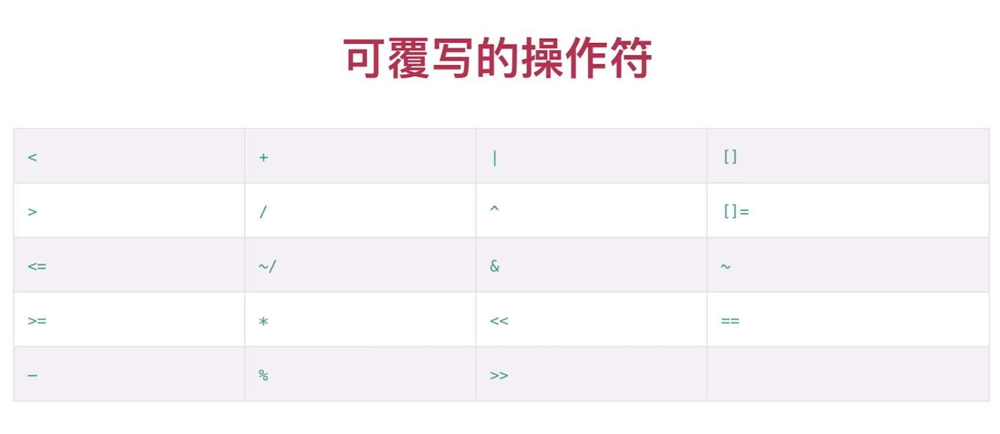

# Dart语法总结

### Dart 语言介绍

- Dart 是Google发布的一门开源编程语言
- Dart 目前可用于全平台开发
- Dart是一门面向对象的编程语言

### 开发环境

[Dart 环境安装] https://www.dartlang.org/tools/sdk#install

IDE 支持

- IntelliJ IDEA Android Studio

- VS Code
- Sublime Text Atom


### 基础语法

#### 变量与常量

使用 var 声明变量，可赋予不同类型的值
未初始化时，默认值为 null
使用 final 声明一个不可改变的值
使用`const`声明编译期常量

```dart
var a;
a = 10;
a = "aaa";
const b = 10;
```

#### 内置数据类型

##### （1）数值型 num (int double)

- 常用属性：isEven（是否偶数）isOdd isNegative
- 常用方法：abs() round() toInt() toDouble()

##### （2）字符串 String

- 常用方法
  contains(), subString() toLowerCase() toUpperCase()
  startsWith() endsWith()

```dart
  String s1 = 'aaa\'';
  String s2 = "aaa'";
  String s3 = """Hello
Dart""";
  String s4 = r'aaa\n';
  String s5 = "s1 = $s1";
  String s6 = "a + b = ${1 + 2}";
```

##### （3）布尔值 bool

##### （4）List

```dart
var list = List();
list = [1, 2, 3, 'Flutter', true];
list[2] = 'Dart';
list.add("value");
list.insert(1, 'element');
list.remove("value");
list.removeAt(1);
var typeList = List<String>(); // 只能添加字符串类型的元素
for (var item in list) {
  print(item);
}
list.forEach((element) => print(element));
```

##### （5）Map

```dart
var map = {'fisrt': 'Dart', 'second': 'Java'};
print(map.length);
print(map.isEmpty);
print(map.isNotEmpty);
print(map.keys);
print(map.values);
print(map.containsKey("key"));
print(map.containsValue("value"));
map['third'] = 'Python';
map.forEach((key, value) => print("key:${key}, value:${value}"));
```

#### 运算符

1、算术运算符 + - */ ~/（取整） %
2、关系运算符 ==(判断内容是否相同) !=, >, <, >=, <=
3、逻辑运算符 ! && ||
4、赋值运算符 = ??= += -+* = /= %= ~/=
5、条件表达式
三目运算符 condition ? expr1 : expr2
?? 运算符 expr1 ?? expr2

```dart
String s = true ? "Male" : "Female";
var s1, s2 = "not null";
s = s1 ?? s2;
```

#### 控制语句

if for while do…while break continue switch…case

#### 注释

```dart
// 这是⼀个⾏注释
/* 这是⼀个多⾏的
 块注释。 */
/* /* */ */
```

#### 方法

- 方法定义

```dart
返回类型 方法名(参数1, 参数2, ...) {
    方法体
    return 返回值
}
```

- 方法特性

  方法也是对象，并且有具体类型 `Function`

  返回值类型、参数类型可省略

  箭头语法：=> expr 是 {return expr} 的缩写，只适用于一个表达式

  方法都有返回值，如果没有指定，默认 return null

  方法不能重载

```dart
String getPerson(String name, int age) {
  return "name = $name, age = $age";
}
printPerson(name, age) {
  print("name = $name, age = $age");
}
getPerson(name) => "name = $name";
```

- 可选参数

  可选命名参数：{param1, param2, …}

  可选位置参数：[param1, param2, …]

  可选参数可以指定默认值

  可选参数只能放在方法的最后

  函数可以使用=为命名参数和位置参数定义默认值。默认值必须是编译时常量。如果没有提供默认值，则默认值为null

```dart
void main() {
  printPerson("zhangsan");
  printPerson("zhangsan", gender: 1);
  printPerson("zhangsan", gender: 1, age: 18);

  printPerson2("zhangsan", 18, 1);
}

printPerson(name, {age = 18, gender = 0}) {
  print("name = $name, age = $age, gender = $gender");
}

printPerson2(name, [age = "18", gender = 1]) {
  print("name = $name, age = $age, gender = $gender");
}
```

- 方法对象

  方法作为对象可以赋值给变量
  方法可以作为另一个方法的参数

```dart
void main() {
  // 方法作为对象可以赋值给变量
  Function fun = times;
  print(fun("name"));

  // 列表数据*3
  List list = ["1", "2", "3"];
  listTimes(list, times);
  // 匿名方法调用形式
  // listTimes(list, (item) => item * 3);
  
  print(list);
}

times(str) {
  return str * 3;
}

// 方法可以作为另一个方法的参数
listTimes(List list, f(item)) {
  for (int i = 0; i < list.length; i++) {
    list[i] = f(list[i]);
  }
  return list;
}
```

- 匿名方法

```dart
(param1, param2, ...) {
    方法体...
    return 返回值;
}
var func = (str) => print(str);
func("test");
```

### 面向对象

#### 类及成员可见性

- Dart中的可见性以`library`为单位
- 默认情况下，每一个Dart文件就是一个库
- 使用_表示库的私有性
- 使用`import`导入库

#### 类及对象

##### （1）属性与方法

- 属性默认会生成getter和setter方法
- 使用final声明的属性只有getter方法
- 方法不能重载

##### （2）计算属性

计算属性的值是通过计算而来，本身不存储值
计算属性赋值，其实是通过计算转换到其它变量

```dart
void main() {
  var rect = new Rect();
//  print(rect.area());
  print(rect.area);
  rect.area = 400;
  print(rect.width);
  print(rect.height);
}
class Rect {
  num width = 20, height = 10;
  num get area => width * height;

  set area(area) {
    width = 20;
    height = area / width;
  }
}
```

##### （3） 构造方法

含有默认构造方法
如果存在自定义构造方法，则默认构造方法无效
构造方法不能重载，使用命名构造方法，可以实现多个构造方法

```dart
class Person {
  String name;
  int age;

//  Person(){}
  Person(this.name, this.age) {
    print(name);
  }

  Person.withName(name) {
    this.name = name;
  }

  Person.withAge(age) {
    this.age = age;
  }
}
```

##### （4）对象操作符

条件访问 ?.
类型转换 as
类型判断 is is!

```dart
Person person;
// ? 不为 null 则执行
person?.work();
person = new Person("zahng ", 15);

if (person is Person) {
  print(person.name);
}
// .. 级联操作符
person..name = "TOM"..age = 20..work();
```

##### （5）抽象类 abstract class、接口

```dart
// 抽象类使用 abstract 表示，不能被直接实例化
// 抽象类可以没有抽象方法
abstract class Person {
  // 抽象方法不用 abstract 修饰
  void eat();
  String name;
}

class Children extends Person {
  @override
  void eat() {}
}

abstract class Runnable {
  void run();
}

// 类就是接口
// implements 需要重写类的所有成员及方法
class Student implements Person , Runnable {

  @override
  String name;

  @override
  void eat() {}

  @override
  void run() {}
}
```

##### （6）Mixins

```dart
// Mixin 类似于多继承，是在多类继承中重用一个类代码的方式
// 作为 Mixin 的类不能声明构造方法
// 作为 Mixin 的类只能继承Object
class A {
  a() => print("A.a()");
}

class B {
  b() => print("B.b()");
}

class C {
  c() => print("C.c()");
}

class D extends A with B, C {
  void d() {
    a(); b(); c();
  }
}
```

##### （7）操作符覆写

覆写操作符需要在类中定义

```dart
返回类型 operator 操作符 (参数1, 参数2) {
    实现
    return 返回值
}
```

如果覆写 ==，还需要覆写对象的hashCode getter 方法


```dart
void main() {
  Person p1 = Person(20);
  Person p2 = Person(18);
  print(p1 > p2);
}

class Person {
  int age;
  Person(this.age);

  bool operator >(Person person) {
    return this.age > person.age;
  }
}
```

### 枚举 enum 和 泛型

```dart
enum Color { red, green, blue }

var list = new List<String>();
```

### 参考

[A Tour of the Dart Language](https://www.dartlang.org/guides/language/language-tour)