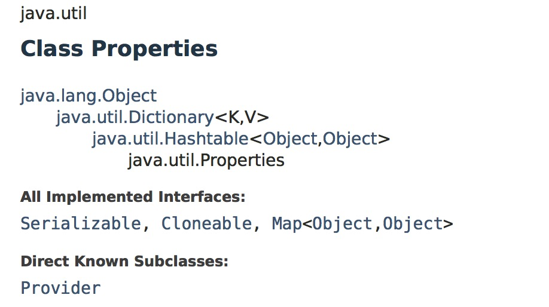
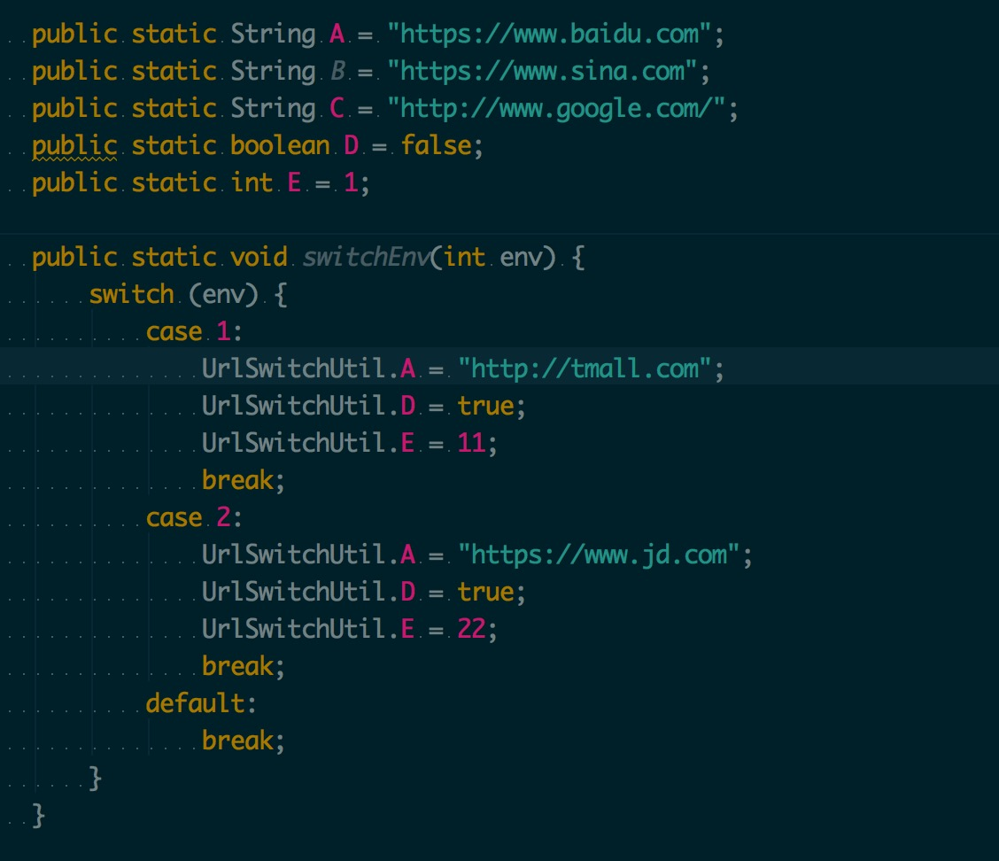

# 2019-11-12-Android 动态环境配置

 发表于 2019-11-12 | 更新于: 2019-12-27 | 分类于 [Android](http://android9527.com/categories/Android/)

 字数统计: 866 | 阅读时长 ≈ 3 分钟

在实际应用开发的过程中经常会遇到切换环境的问题，本文提供一个动态切换环境的方法。

#### 先介绍下 Java Properties 类



Java中有个比较重要的类Properties（Java.util.Properties），主要用于读取Java的配置文件。
它提供了几个主要的方法：

- getProperty(String key)，用指定的键在此属性列表中搜索属性。也就是通过参数 key ，得到 key 所对应的 value。

- load(InputStream inStream)，从输入流中读取属性列表（键和元素对）。通过对指定的文件（比如说上面的 test.properties 文件）进行装载来获取该文件中的所有键 - 值对。以供 getProperty ( String key) 来搜索。

- setProperty(String key, String value) ，调用 Hashtable 的方法 put 。他通过调用基类的put方法来设置 键 - 值对。

- store(OutputStream out, String comments)，以适合使用 load 方法加载到 Properties 表中的格式，将此 Properties 表中的属性列表（键和元素对）写入输出流。与 load 方法相反，该方法将键 - 值对写入到指定的文件中去。

- clear()，清除所有装载的 键 - 值对。该方法在基类中提供。

  

  #### Properties 类读写文件操作

```
#Steven1997 modify on Mon Nov 18 10:32:28 CST 2019
username=root
password=root
url=jdbc\:mysql\://localhost\:3306/
database=users
/***
 * 读取配置
 */
public static void readProperties() {
    try {
        File file = new File("config.properties");
        InputStream inputStream = new FileInputStream(file);
        Properties property = new Properties();
        property.load(inputStream);
        System.out.println(property.size());
    } catch (Exception e) {
        e.printStackTrace();
    }
}

/***
 * 写入配置
 */
public static void writeProperties() {
    Properties properties = new Properties();
    OutputStream output = null;
    try {
        output = new FileOutputStream("config.properties");
        properties.setProperty("username", "root");
        properties.setProperty("password", "root");
        properties.setProperty("database", "users");
        properties.store(output, "Steven1997 modify on " + new Date().toString());
        // 保存键值对到文件中
    } catch (IOException io) {
        io.printStackTrace();
    } finally {
        if (output != null) {
            try {
                output.close();
            } catch (IOException e) {
                e.printStackTrace();
            }
        }
    }
}
```

#### 最开始的做法

一般环境域名较少的时候，我们会创建一个类来管理这些域名
切换环境的时候来修改里面的变量的值，当随着域名增加的时候，导致类中的代码越来越膨胀，代码看起来很是费劲，如图。


#### 使用 Properties 配合 反射 的做法

将多套环境地址分别写入不同的 Properties 文件中，使用键值对的形式保存
url_1.properties
url_2.properties
读取配置文件中，遍历 BaseUrl 中的变量，如果存在则反射修改。

```
/**
 * 环境切换
 */
public static void switchEnv(int envType, Class clz) {
    try {
        String path = "";
        switch (envType) {
            case 1:
                path = "url_1.properties";
                break;
            case 2:
                path = "url_2.properties";
                break;
        }
        if (TextUtils.isEmpty(path)) {
            return;
        }
        File file = new File(path);
        InputStream inputStream = new FileInputStream(file);
        Properties property = new Properties();
        property.load(inputStream);

        if (property.isEmpty()) {
            return;
        }
        Field[] fields = clz.getDeclaredFields();
        for (Field field : fields) {
            // 获取属性的名字
            String name = field.getName();
            if (!property.containsKey(name)) {
                continue;
            }
            field.setAccessible(true);
            // 获取属性的类型
            String type = field.getGenericType().toString();
            if ("class java.lang.String".equals(type)) {
                field.set(null, property.getProperty(name));
            } else if ("boolean".equals(type)) {
                field.set(null, Boolean.parseBoolean(property.getProperty(name)));
            } else if ("int".equals(type)) {
                field.set(null, Integer.parseInt(property.getProperty(name)));
            }
        }
    } catch (Exception e) {
        e.printStackTrace();
    }
}
```

#### 注意点：

- 默认域名直接写在 BaseUrl 类中
- 对应的其他环境分别在assets目录新建一个配置来保存：
  url_1.properties
  url_2.properties
  …
- 切换环境后会去读取对应的配置来覆盖默认配置，配置文件中存在对应域名存则覆盖，不存在还保持默认域名
- 要修改的变量要求是 static 修饰，并且不能加 final
- 目前支持 String int boolean 类型